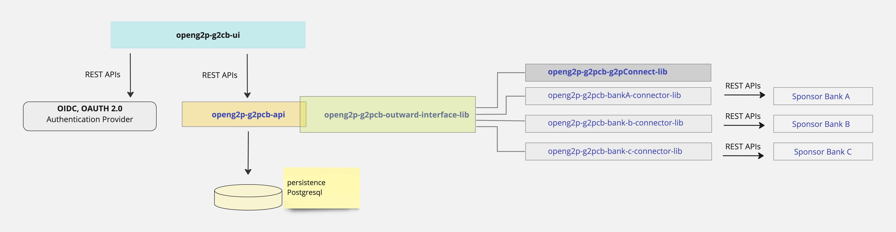

---
layout:
  title:
    visible: true
  description:
    visible: false
  tableOfContents:
    visible: true
  outline:
    visible: true
  pagination:
    visible: true
---

# Interfaces

<figure><figcaption>
openg2p-g2cb - Technical architecture
</figcaption></figure>

Refer to the Technical architecture. As shown in the figure, all outward APIs towards a Sponsor bank is abstracted through an interface - openg2p-g2cb-outward-interface-lib.

This interface library provides for the following method signatures

check\_funds\_with\_bank

block\_funds\_with\_bank

create\_disbursements
