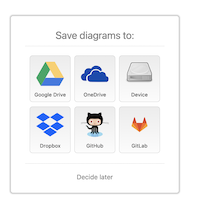
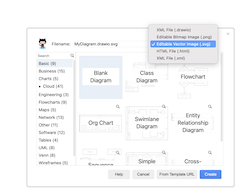

# Creating Diagrams

## Context

Creating editable diagrams in open formats using open source tools is challenging. Here, we suggest [Draw.io](https://app.diagrams.net/) for creating diagrams and saving them directly in GitHub repository.

## Creating new diagram

* On [Draw.io](https://app.diagrams.net/) website choose _Device_ as your storage.

<figure><figcaption></figcaption></figure>

* Select the format of the diagram as `.svg`

<figure><figcaption></figcaption></figure>

* Create the diagram and save it on your local machine. Make sure you follow the file naming convention of lowercase with hyphens as word separations.
* Login to Gitbook and open the page you want to insert the image.
* Insert the image using the options shown by Gitbook.

## Editing existing diagram

* Fork `openg2p-documentation` repository to your local Github account.
* On [Draw.io](https://app.diagrams.net/) website choose Github as your storage.

<figure><figcaption></figcaption></figure>

* Authorize the Draw.io app on Github (follow the steps prompted).&#x20;
* Select the diagram from `openg2p-documentation` --> your branch --> `.gitbook/assests` folder.

<figure><figcaption></figcaption></figure>

* Make changes.
* Save the diagram - it will get git committed to your repository.
* Send a Pull Request to `OpenG2P/openg2p-documentation` repo.
