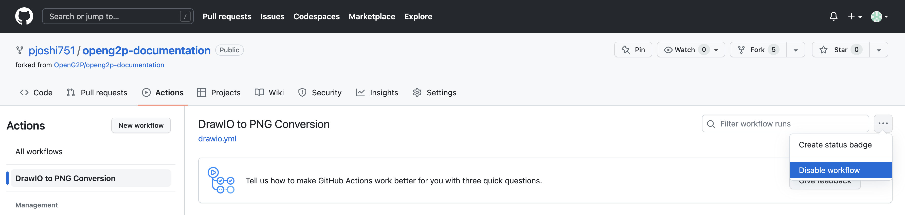
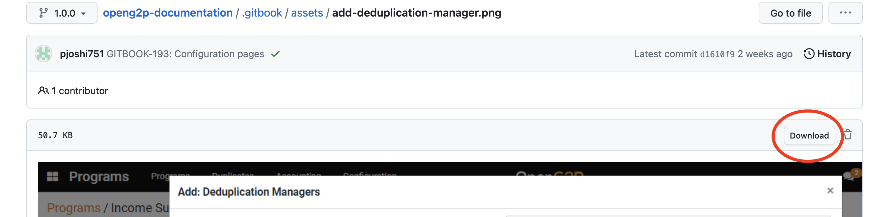
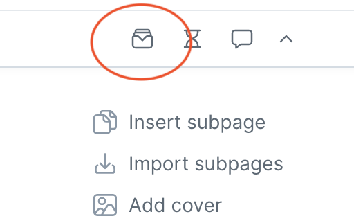

# Creating Diagrams

## Context

Creating editable diagrams in open formats using open source tools is challenging. Here, we suggest [Draw.io](https://app.diagrams.net/) for creating diagrams and saving them directly in GitHub repository.

## Creating new diagram

1. On [Draw.io](https://app.diagrams.net/) website choose _Device_ as your storage.

<figure><figcaption></figcaption></figure>

2. Select the format of the diagram as XML`.drawio.`&#x20;

<figure><figcaption></figcaption></figure>

3. Create the diagram and save it on your local machine. Make sure you follow the file naming convention of lowercase with hyphens as word separations.
4. Fork `openg2p-documentation` repository to your Github account.&#x20;
5. Disable workflow in your repository fork:

<figure><figcaption></figcaption></figure>

6. On Github, upload/commit the `.drawio` file to **your fork** of `openg2p-documentation` repository in the branch of choice to the following folder: `.gitbook/assets`.&#x20;
7. Send a Pull Request.
8. After the PR is merged on the upstream repo a [Gitbook Action Workflow](../../.github/workflows/drawio.yml) will get triggered to convert the same to PNG format with `*.png` extension. The PNG file will be available in the same folder as the `.drawio` file. In this case, it will be the repository's `.gitbook/assets` folder.&#x20;
9. On Gitbook, insert the PNG image using the _URL_ options shown by Gitbook. The URL to be given will be the
GitHub URL e.g.
[https://github.com/OpenG2P/openg2p-documentation/raw/1.1/.gitbook/assets/add-deduplication-manager.png](https://github.com/OpenG2P/openg2p-documentation/raw/1.1/.gitbook/assets/add-deduplication-manager.png). Make sure you pick this URL in **Raw** format which will be available on the _Download_ button on Github

<figure><figcaption></figcaption></figure>

## Editing existing diagram

If a `.drawio` already exists in the `.gitbook/assets` folder then you must directly edit the repository version of the same by following the procedure given below.

1. Fork the `openg2p-documentation` repository to your local Github account. Disable workflow as shown above.
2. On the [Draw.io](https://app.diagrams.net/) website choose Github as your storage.

<figure><figcaption></figcaption></figure>

3. Authorize the Draw.io app on Github (follow the steps prompted).&#x20;
4. Select the diagram in `.drawio` format from `openg2p-documentation` --> your branch --> `.gitbook/assests` folder.

<figure><figcaption></figcaption></figure>

5. Make changes.
6. Save the diagram - it will get Git-committed to your repository.
7. Send a Pull Request to `OpenG2P/openg2p-documentation` repo.
8. Upon acceptance of the Pull Request, a [Github Action Workflow](../../.github/workflows/drawio.yml) will trigger the conversion of the`.drawio` file to `.png`.&#x20;
9. If you have not added the URL of the PNG to your Gitbook pages follow step 6 of [Creating New Diagram](creating-diagrams.md#creating-new-diagram).
10. If the URL already exists in Gitbook, the updated image should appear after a page refresh.

## Deleting a digram

1. Delete the diagram from Gitbook listing found here:

<figure><figcaption></figcaption></figure>

2. Delete the diagram from Github repository `openg2p-documentation` from the corresponding branch&#x20;
