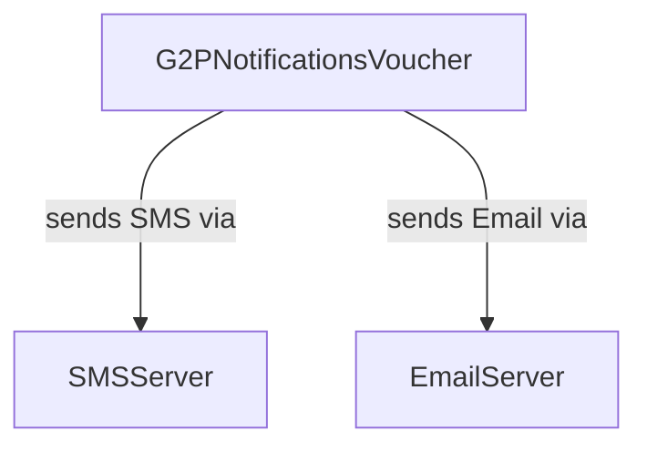

# OpenG2P Module Doc Template

### Module name

g2p\_notifications\_voucher

### Module title

G2P Notifications: Voucher

### Technology base

\<Odoo/Springboot/FastAPI>

### Functionality

* Is it an extension of an existing module?
* What does this model do/support as functionality?
* What are the limitations and features/functions not supported?
* Is it overriding any existing functionality?

### Design notes

* What are salient design features?
* Why were certain design decisions taken in a particular way?
* Design patterns used.
* Algorithms used.
* Anything a developer should know about the design of this module.
* Any scope for improvement and further design work that is pending.

### Relationships with other entities

### Dependencies

* Any external libraries used. List them.
* `g2p_entitlement_voucher`&#x20;
* `g2p_notifications_base`

### User interface

* Any new screens created/modified (with screenshots)
* Any new menu items created.
* Any new actions created.

### Configuration&#x20;

* Any system configurations and parameters that apply to this module.
* Any configurations required for using this module. (List)

### Error codes&#x20;

* What are the error codes/exceptions thrown by this module.&#x20;

### Source code

### Installation

###
