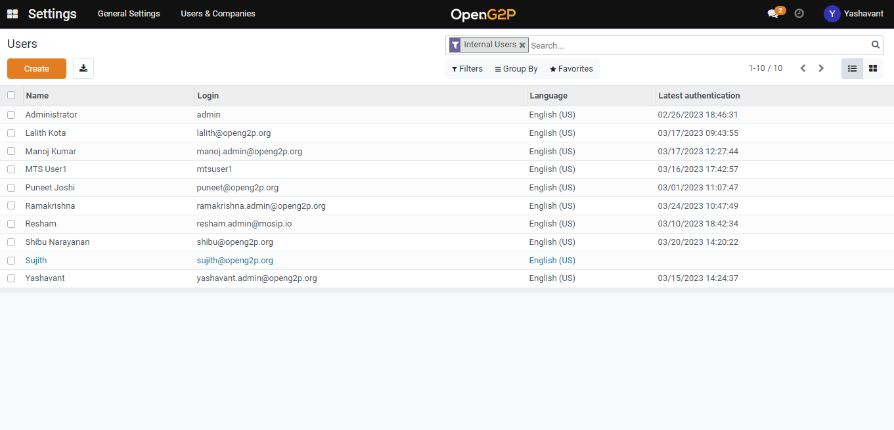

# Create User and Assign Role

## Description

This document contains the step-by-step instruction to create a new user and assign a role. A person who has admin access can create a new user and assign a role.

## Pre-requisites

A user should have an admin access to create a new user and assign a role.

## Procedure

1. In the menu bar, click the icon  and select _**Settings**_.&#x20;
2. The _**Settings**_ screen is displayed

<figure><figcaption>
Choose Settings Screen
</figcaption></figure>

<figure><figcaption>
Settings Screen
</figcaption></figure>

2. Click the _**Users & Companies**_ tab and then select _**Users**_.

<figure><figcaption></figcaption></figure>

2. Click on the _Create_ button to reach user creation page.

<figure><figcaption></figcaption></figure>

4. _Email:_ Provide a valid email Id. The invitation email will be sent to this Id.
5. Select the role for a user from the _OpenG2P module access_ section.

<figure><figcaption></figcaption></figure>

6. Once the user is saved it will be listed under the user list view page and the invitation mail will be triggered.

<figure><figcaption></figcaption></figure>
