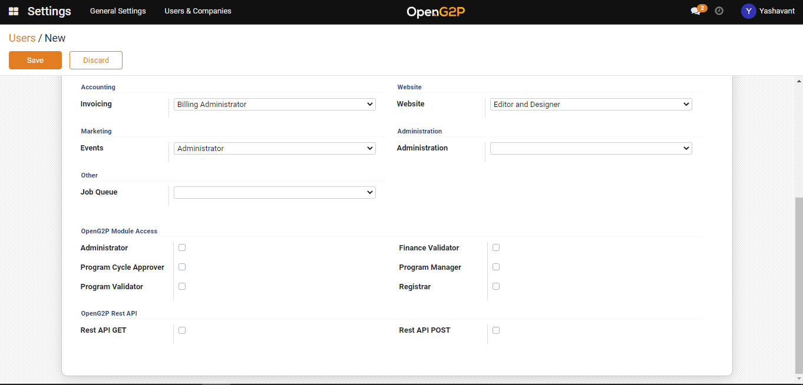

# Create User and Assign Role

## Description

The guide here provides steps to create a new user and assign a role. This process is typically done by the Administrator.

## Pre-requisites

The user should have an Administrator role.

## Steps

1. Navigate to _Settings_ using the menu bar.

<figure><figcaption></figcaption></figure>

2. Click on _Users & Companies_ and then select _Users_ to reach user's list view page.

<figure><figcaption></figcaption></figure>

3. Click on the _Create_ button to reach user creation page.

<figure><figcaption></figcaption></figure>

4. _Email:_ Provide a valid email Id. The invitation email will be sent to this Id.
5. Select the role for a user from the _OpenG2P module access_ section.

<figure><figcaption></figcaption></figure>

6. Once the user is saved it will be listed under the user list view page and the invitation mail will be triggered.

<figure><figcaption></figcaption></figure>
