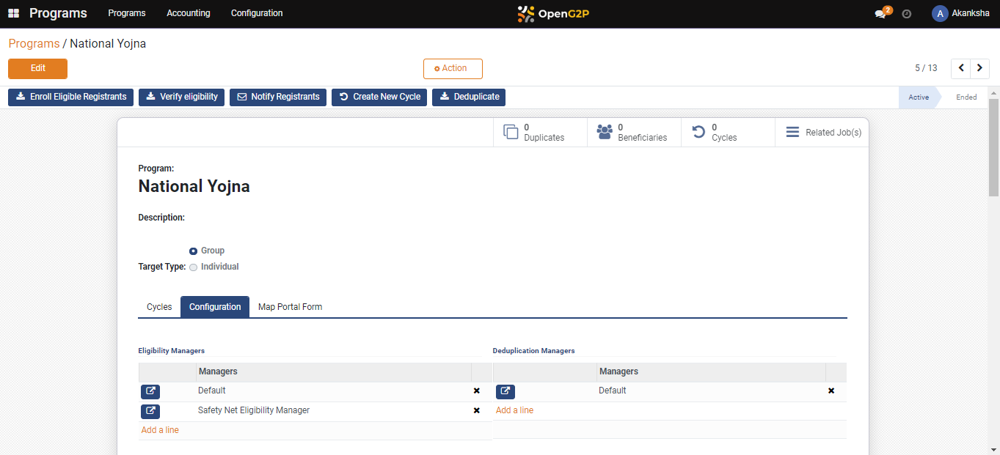
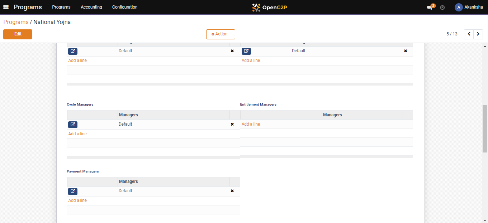
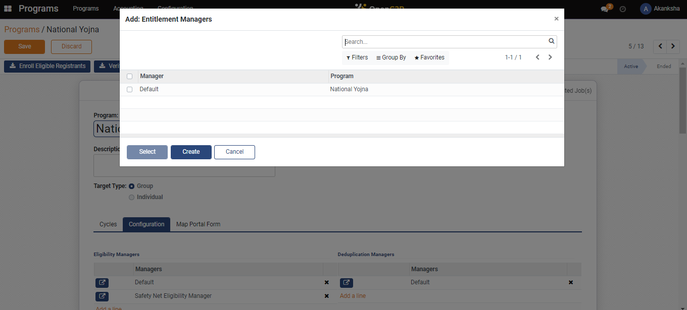
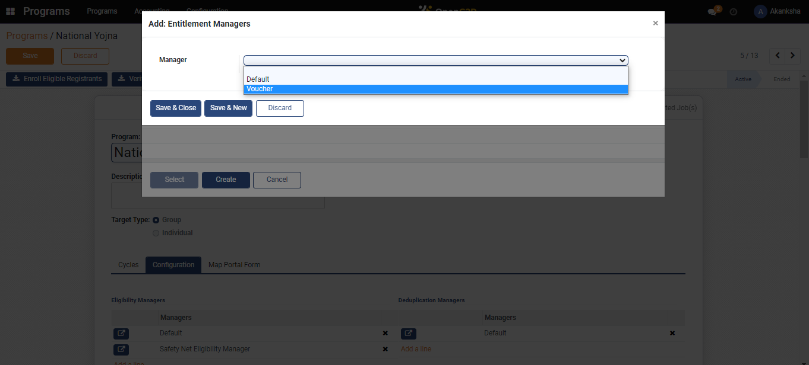
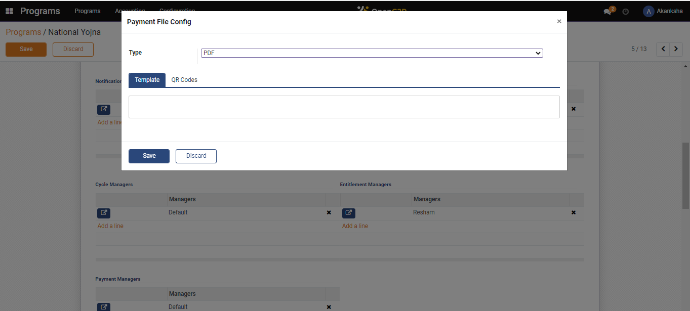
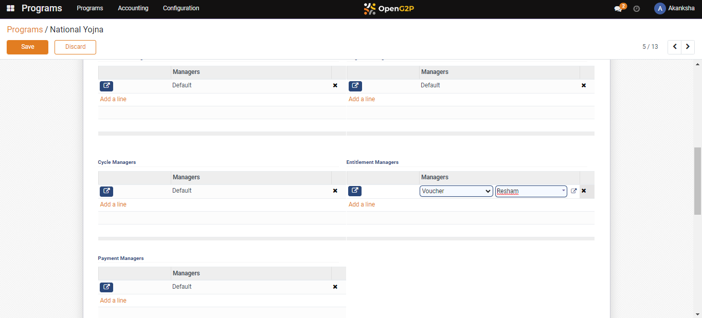

# Configure Entitlement Voucher

## Description

This guide provides steps to add entitlement vouchers for the beneficiaries. The entitled beneficiaries can use these vouchers to avail of a service.&#x20;

## Pre-requisites

The user must have the Program Administrator role.

## Steps

1. Navigate to _Programs_ using the menu bar.

<figure><figcaption></figcaption></figure>

2. Click on the _Program Name_ for which configuration is to be done.

<figure><figcaption></figcaption></figure>

3. Navigate to the _Configuration_ section on Program detailed view page.

<figure><figcaption></figcaption></figure>

4. Click on _Add a Line_ in the Entitlement Managers section.

<figure><figcaption></figcaption></figure>

5. A pop-up window appears, click on _Create._

<figure><figcaption></figcaption></figure>

6. Another Pop-up window appears, Select V_oucher_ from the drop-down.

<figure><figcaption></figcaption></figure>

7. Navigate to the newly developed box, enter the manager's name, and click on _Create and Edit_.

<figure><figcaption></figcaption></figure>

8. A new dialogue box appears enter the amount per cycle, fill in the necessary details, type the voucher file configuration, and click on _Create and Edit._

<figure><figcaption></figcaption></figure>

9. A _Payment File Configuration_ pop-up appears, select the _Type_, add the _Template_ and _QR Code_, and click on _Save_.&#x20;

<figure><figcaption></figcaption></figure>

10. Under the _Entitlement Manager_, the voucher with the assigned name gets created.

<figure><figcaption></figcaption></figure>
