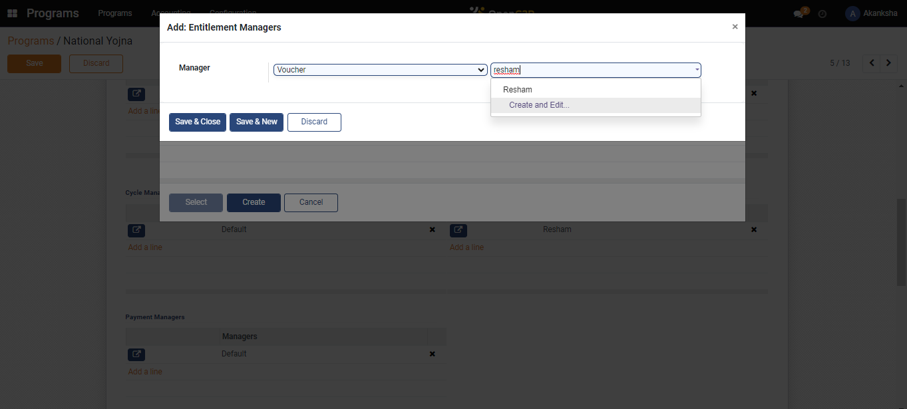
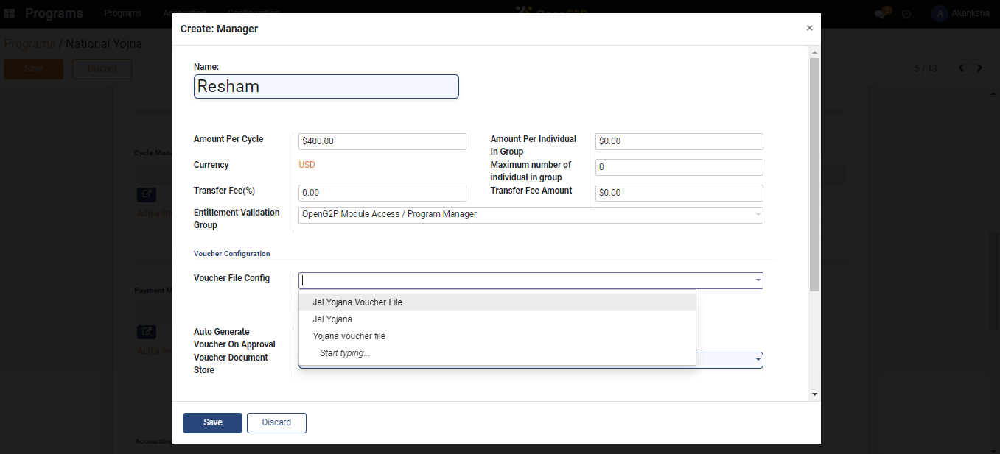

# Configure Entitlement Voucher

## Description

This guide provides steps to create an entitlement voucher template. The beneficiary details are auto-filled in the entitlement voucher for the beneficiary based on the template configuration. The entitled beneficiaries can use these vouchers to avail cash and other assistance from an authorized service provider.

## Pre-requisites

The user must have the Program Administrator role.

## Steps

1. Navigate to _Programs_ using the menu bar.

<figure><figcaption></figcaption></figure>

2. Click on the program name for which configuration is to be done.

<figure><figcaption></figcaption></figure>

3. Navigate to the _Configuration_ section in the program's detailed view page.

<figure><figcaption></figcaption></figure>

4. Click on _Add a Line_ in the _Entitlement Managers_ section.

<figure><figcaption></figcaption></figure>

5. A pop-up window appears. Click on _Create._

<figure><figcaption></figcaption></figure>

6. Another pop-up window appears. Select V_oucher_ from the _Manager_ drop-down list.

<figure><figcaption></figcaption></figure>

7. Another drop-down appears beside the _Manager_ drop-down. Navigate to the new drop-down, enter the manager's name, and select _Create and Edit_.

<figure><figcaption></figcaption></figure>

8. A new dialogue box appears. Enter the amount per cycle, fill in the necessary details, type the voucher file configuration, and click on _Save._

<figure><figcaption></figcaption></figure>

9. A _Payment File Config_ pop-up appears. Select the _Type_ as _PDF_, add the _Template_ and _QR Codes_, and click on _Save_.&#x20;

<figure><figcaption></figcaption></figure>

10. In the _Entitlement Manager_ section, the entitlement voucher gets created.

<figure><figcaption></figcaption></figure>
