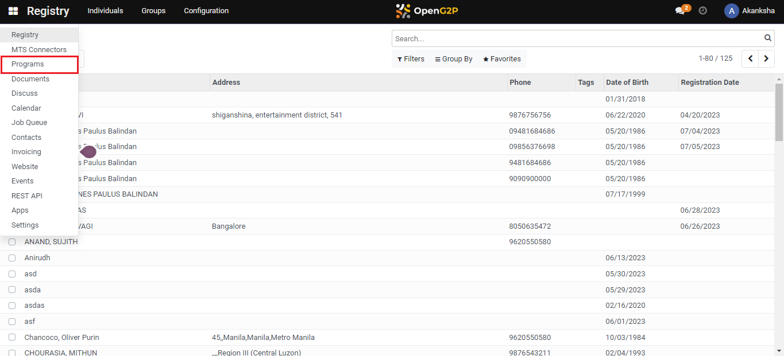

# Configure Entitlement Voucher

## Description

This guide provides steps to create an entitlement voucher template. The beneficiary details are auto-filled in the entitlement voucher for the beneficiary based on the template configuration. The entitled beneficiaries can use these vouchers to avail cash and other assistance from an authorized service provider.

## Pre-requisites

The user must have the Program Administrator role.&#x20;

## Steps

1. Navigate to _Programs_ using the menu bar.

<figure><figcaption></figcaption></figure>

2. Select the desired program to configure.

<figure><figcaption></figcaption></figure>

3. Navigate to the _Configuration_ section on the program's detailed view page.

<figure><figcaption></figcaption></figure>

4. Click on _Add a Line_ in the _Entitlement Managers_ section.

<figure><figcaption></figcaption></figure>

5. A pop-up window appears. Click on _Create._

<figure><figcaption></figcaption></figure>

6. Another pop-up window appears. Select V_oucher_ from the _Manager_ drop-down list.

<figure><figcaption></figcaption></figure>

7. Another drop-down appears beside the _Manager_. Select the name for the entitlement manager and click on _Create and Edit_.

<figure><figcaption></figcaption></figure>

8. A new dialogue box appears. Fill in the _Amount Per Cycle_, and other necessary details. Select the _Voucher File Configuration_ from the drop-down lis_t_, and click on _Save_.

<figure><figcaption></figcaption></figure>

9. The manager gets added, click on _Save and Close_.

<figure><figcaption></figcaption></figure>

10. In the _Entitlement Manager_ section, an entitlement voucher is created.

<figure><figcaption></figcaption></figure>
