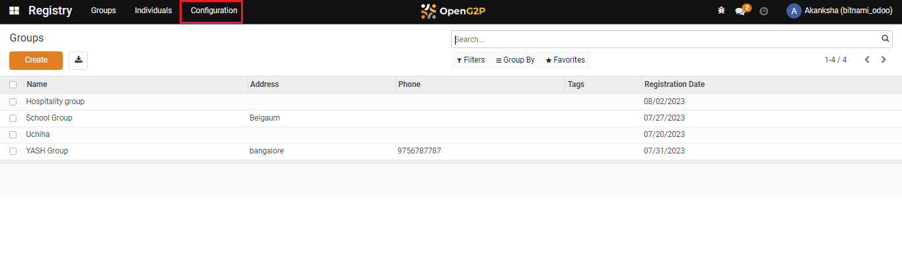
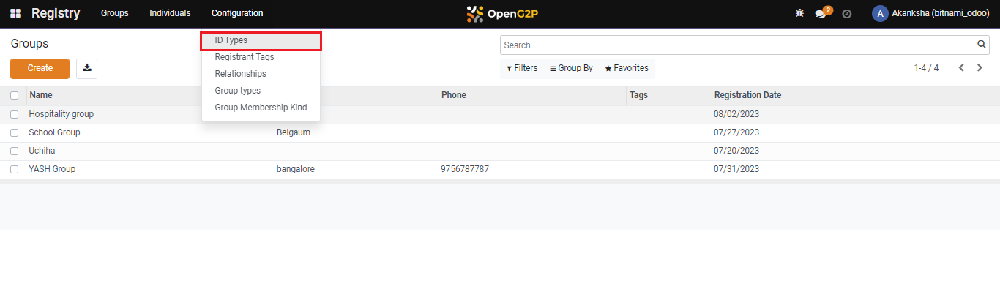
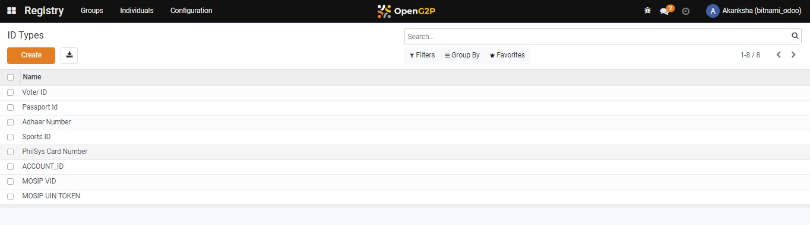
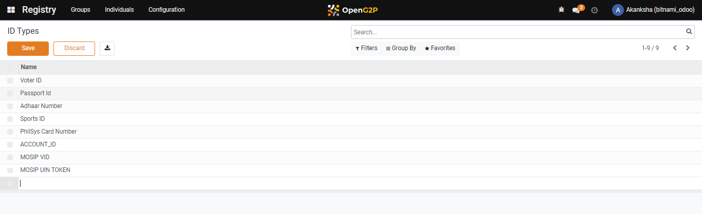
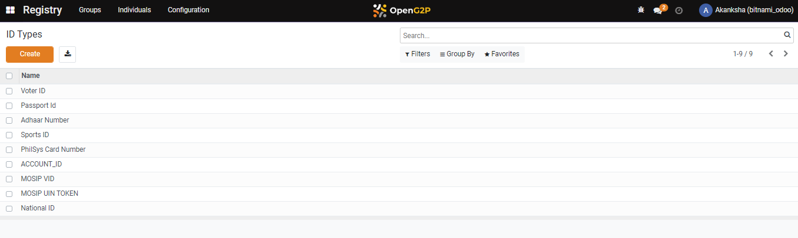

# Configure ID Types

## Description

This guide provides steps to create an ID type, which are essential for verifying eligibility and the deduplication process.

## Pre-requisites

The user must have the Program Administrator role.

## Steps

1. Click on _Configuration._

<figure><figcaption></figcaption></figure>

2. Click on _ID Types_.

<figure><figcaption></figcaption></figure>

3. Click on _Create_.

<figure><figcaption></figcaption></figure>

4. A new bar appears. Enter the name and click on _Save_.

<figure><figcaption></figcaption></figure>

5. The new ID type gets added to the list.

<figure><figcaption></figcaption></figure>
