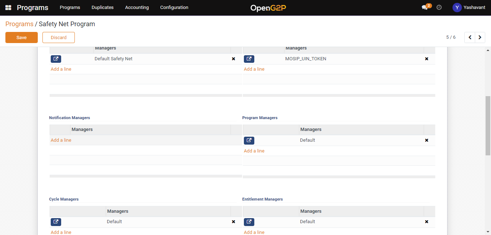
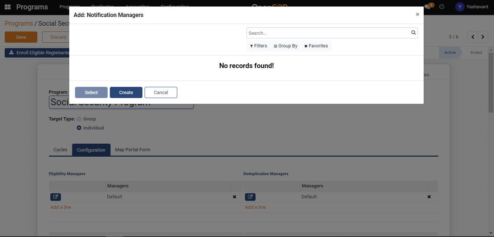
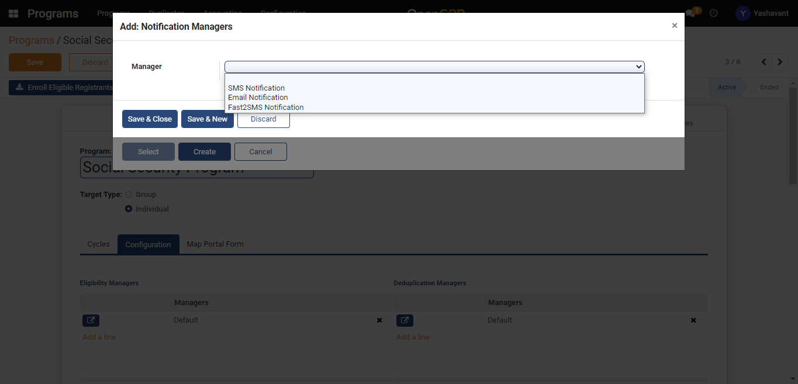
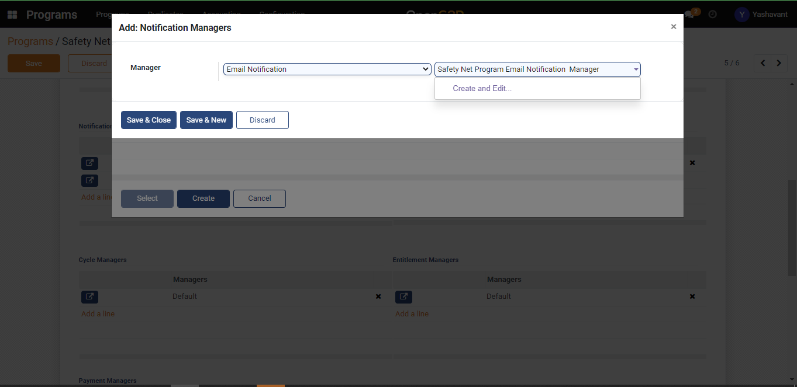
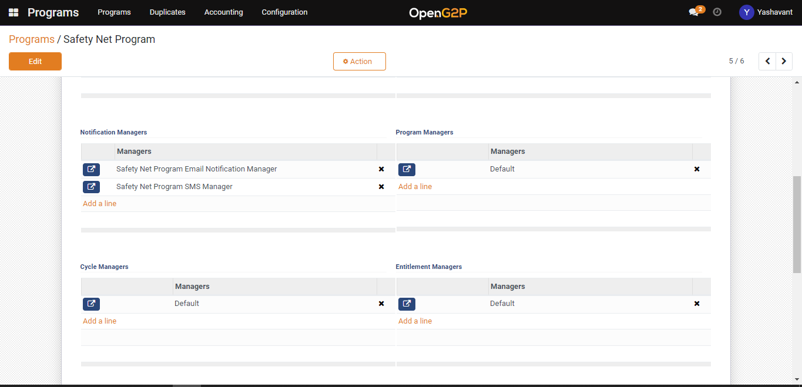

# Configure Notification Manager

## Description

This guide provides steps to create and configure the deduplication manager.

## Pre-requisites

The user must have the Program Manager role.

## Steps

1. Navigate to Programs using the menu bar.&#x20;

<figure><figcaption></figcaption></figure>

2. Click on the program name for which configuration to be done.&#x20;

<figure><figcaption></figcaption></figure>

3. Navigate to the Configuration section on Program detailed view page.

<figure><figcaption></figcaption></figure>

4. &#x20;Click on _Add a line_ in the Notification Manager section.&#x20;

<figure><figcaption></figcaption></figure>

5. Click on the _Create_ button on the Add: Notification Managers pop-up window.&#x20;

<figure><figcaption></figcaption></figure>

6. Select the notification manager type.&#x20;

<figure><figcaption></figcaption></figure>

7. Once the name is provided to the deduplication manager, _Create and Edit_ buttons will appear. Click on _Create and Edit_ to create a deduplication manager. &#x20;

<figure><figcaption></figcaption></figure>

8. Click on the _Save & Close_ button which will save the notification manager to that program under configuration.

<figure><figcaption></figcaption></figure>
