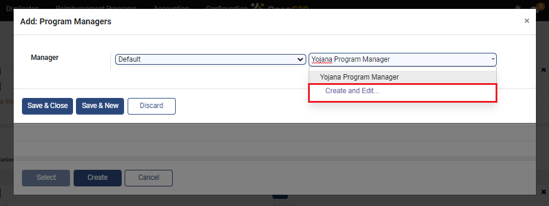
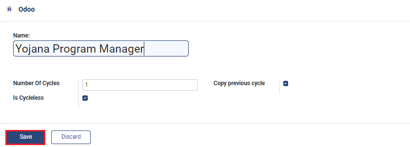
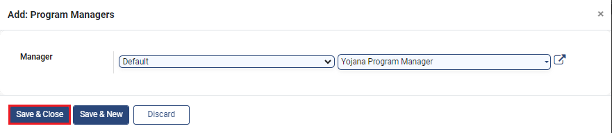
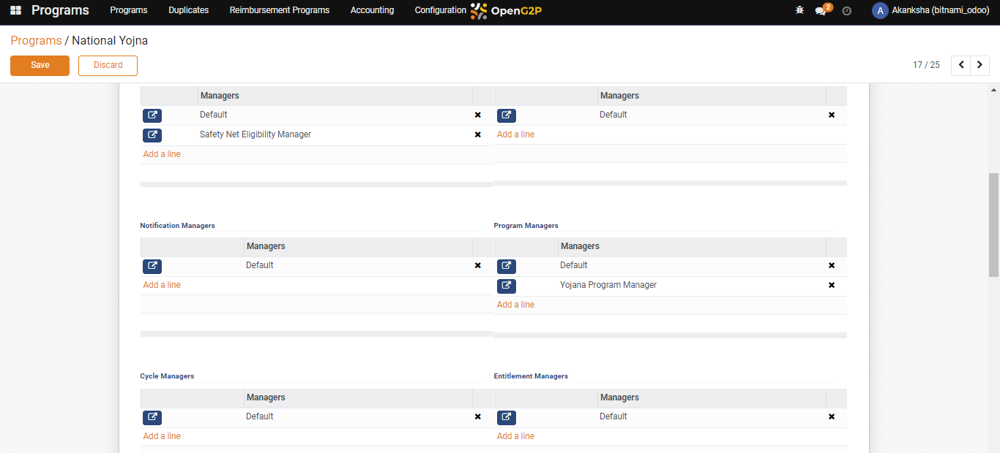

# Configure Program Manager in Program

## Description

This guide provides steps to add multiple program managers for the program. The program manager is responsible for creating and assessing the cycles for the program.

## Pre-requisites

The user must have the Program Administrator role.

## Steps

1. Navigate to _Programs_ using the menu bar.

<figure><figcaption></figcaption></figure>

2. Click on the program name for which configuration is to be done.

<figure><figcaption></figcaption></figure>

3. Navigate to the _Configuration_ section on the program detailed view page

<figure><figcaption></figcaption></figure>

4. Click on the _Add a line_ in the _Program Managers_ section.

<figure><figcaption></figcaption></figure>

5. A pop-up window appears. Click on _Create_.

<figure><figcaption></figcaption></figure>

6. Another Pop-up window appears. Select _Default_ from the drop-down.
7. Navigate to the newly developed box, enter the manager's name, and click on _Create and Edit_.

<figure><figcaption></figcaption></figure>

8. Enter the _Number of Cycles_ and check the box _Copy previous cycle_ and _Is Cycleless._
9. Click on _Save._

<figure><figcaption></figcaption></figure>

10. The manager gets added to the list of entitlement managers for the program. Click on _Save & Close_.

<figure><figcaption></figcaption></figure>

10. Delete the default program manager and click on _Save_.

<figure><figcaption></figcaption></figure>
