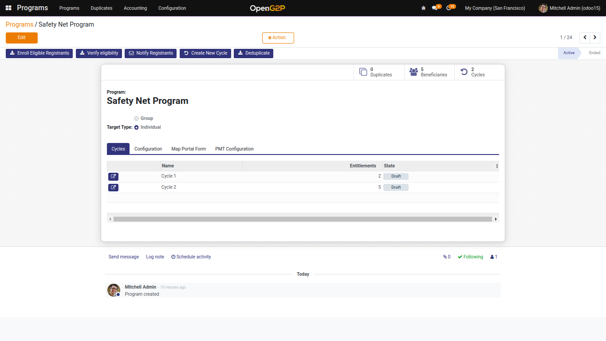
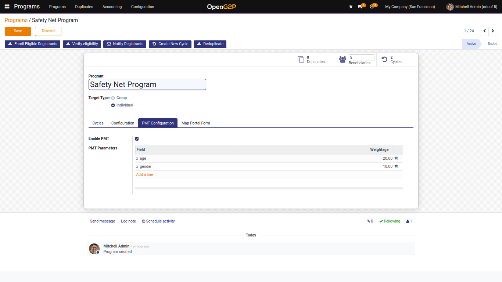
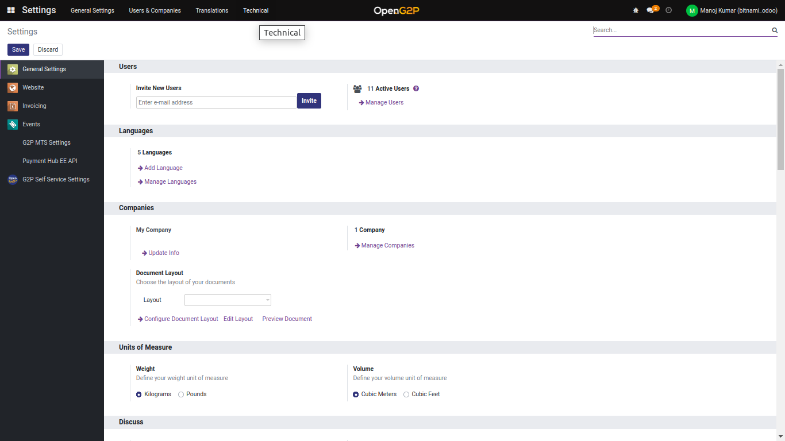
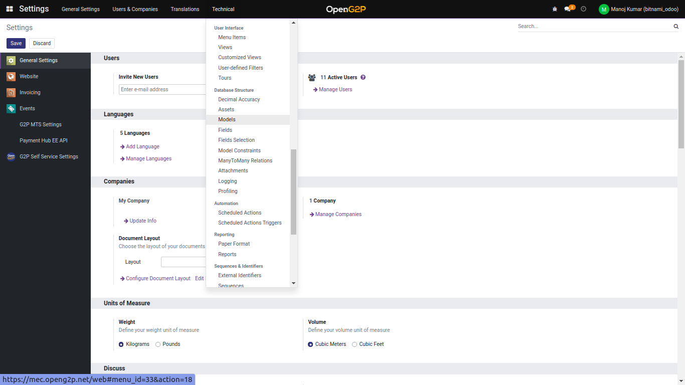
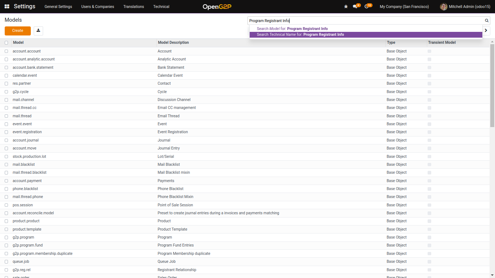
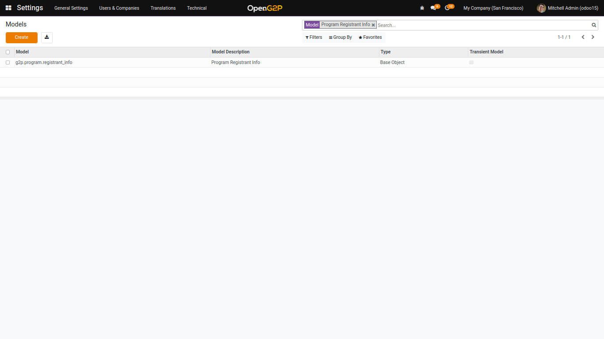
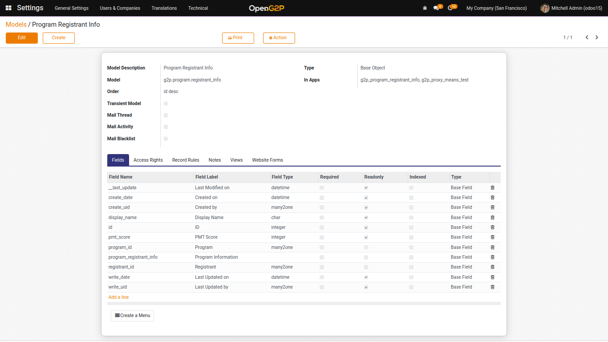
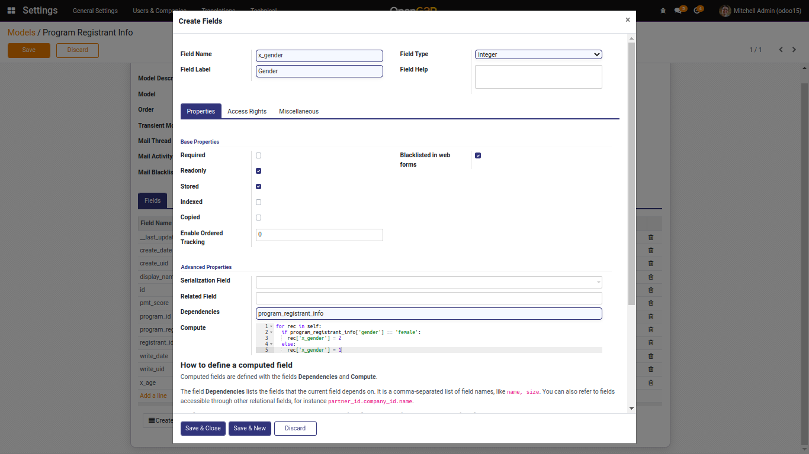
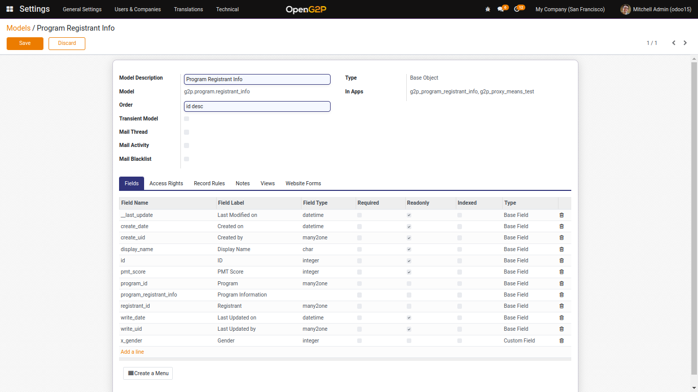

# Configure Proxy Means Test

## Description

The guide provides steps to enable and configure the Proxy Means Test.

## Pre-requisites

The user must have a Program Manager role.

## Steps

1. Navigate to _Programs_ using the menu bar.

<figure><figcaption></figcaption></figure>

2. Click on the program name for which configuration to be done.

<figure><figcaption></figcaption></figure>

3. Navigate to the _PMT_ _Configuration_ section on Program detailed view page.

<figure><figcaption></figcaption></figure>

4. Enable PMT and click on _Add a line_ in the _PMT Parameters_ field.

<figure><figcaption></figcaption></figure>

5. Select the field and provide its weightage.

<figure><figcaption></figcaption></figure>


The above-mentioned selection fields are computed fields and can be added in the settings.


6. Click on the _Save & New_ button to select a new field and provide its weightage or _Save & Close_ button which will save the fields and their weightage to that program under configuration.

<figure><figcaption></figcaption></figure>

7. Click on the _Save_ button.

## Steps to add computed fields


Enable developer mode.

Settings --> Developer Tools --> 'Activate the developer mode'


1. Navigate to _Settings_ using the menu bar.

<figure><figcaption></figcaption></figure>

2. Click on _Technical_ in the setting menu.

<figure><figcaption></figcaption></figure>

3. Navigate to _Models_ under _Database Structure_ heading.

<figure><figcaption></figcaption></figure>

4. Search _Program Registrant Info_ model in the search bar.

<figure><figcaption></figcaption></figure>

5. Click on _g2p.program.registrant\_info_ model.

<figure><figcaption></figcaption></figure>

6. Click on _add a line_ in Fields section.

<figure><figcaption></figcaption></figure>

6. Add field name, type, label, dependencies field and compute logic.

<figure><figcaption></figcaption></figure>

8. Click on the _Save & New_ button to select a new computed field or _Save & Close_ button which will save the computed field in the model.

<figure><figcaption></figcaption></figure>

9. Click on the _Save_ button.


So, these computed fields will display in the selection field of PMT Configuration.

