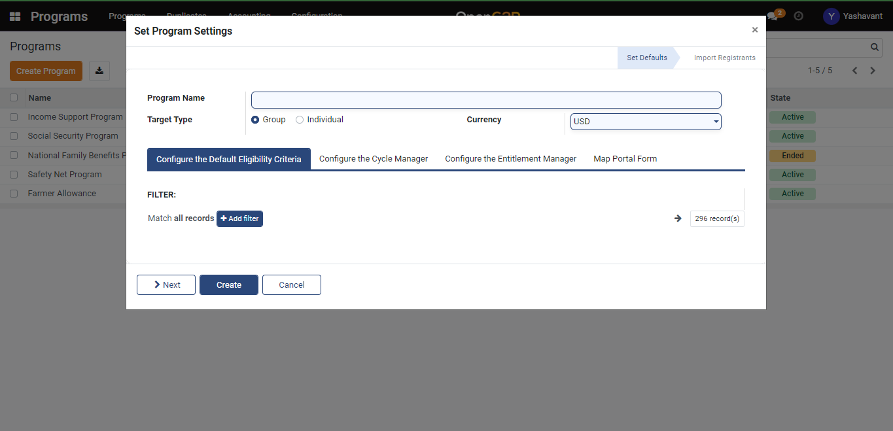
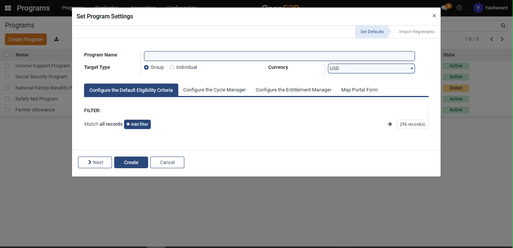
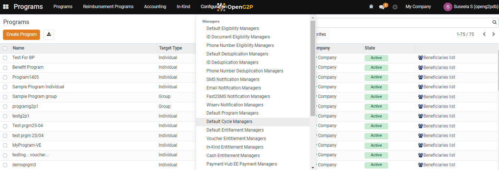
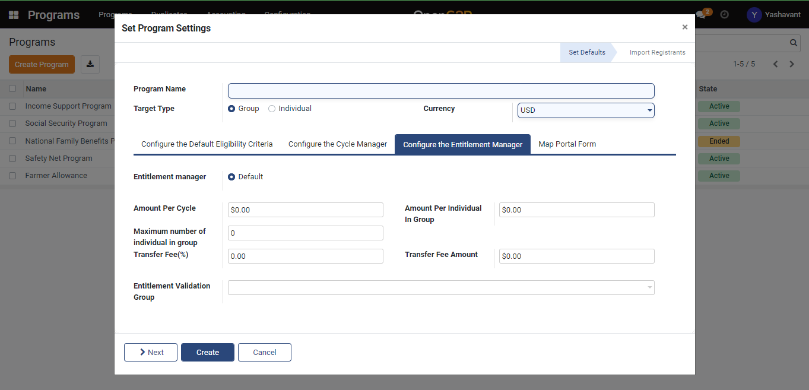
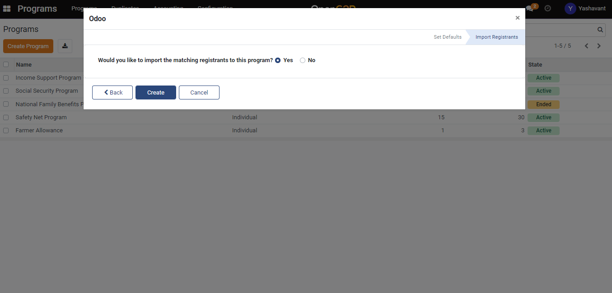

# Create a Program

## Description&#x20;

The guide here provides steps to create a new program. A program is typically created by a Program Manager who can create and administer programs.

## Pre-requisites

* The user should have a Program Manager role.

## Steps

1. Navigate to Program using the menu bar.

<figure><figcaption></figcaption></figure>

2. Click on the Create Program button and will be navigated to the Program creation page.

<figure><figcaption></figcaption></figure>

3. Target Type - To know more about target type click here.
4. Eligibility Manager&#x20;

* Use the '+Add filter' button to set the eligibility criteria.
* Using existing filters set multiple eligibility criteria.

<figure><figcaption></figcaption></figure>

5. Cycle Manager

* Auto approve Entitlements - For auto approving the entitlements.
* Approver Group -  Mapped role user should be able to approve the cycles.
* Recurrence - The time period for the repetition of a cycle is defined.

<figure><figcaption></figcaption></figure>

6. Entitlement Manager

* Amount Per Cycle - The amount disbursement of a group or individual per cycle is defined.&#x20;
* Amount Per Individual In Group - When the target type is a group disbursement amount per individual in a group is defined.
* The maximum number of individuals in a group - Sets the maximum number of individuals who get disbursements per group(optional).
* Transfer Fee(%) - Sets the transfer fee per disbursement(optional).
* Transfer Fee Amount - Set the transfer fee amount per disbursement(optional)
* Entitlement Validation Group - Mapped role user should be able to validate the entitlements.&#x20;

<figure><figcaption></figcaption></figure>

5. A portal form needs to be created before mapping it while creating the program(Portal Form Creation).
6. Click the 'Next' button to import the matching registrants to the creating program and in the pop-up window select 'Yes'.

<figure><figcaption></figcaption></figure>

7. Once the program is created it will be listed under the program list view page.

<figure><figcaption></figcaption></figure>

