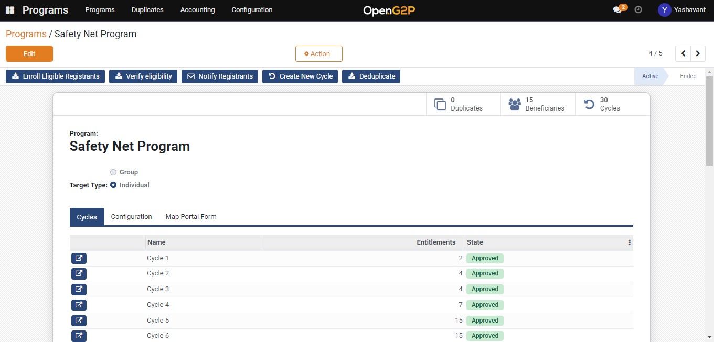

# Create and Approve Program Cycle

## Description

This guide will provide the steps to create and approve the disbursement cycle under a program.

## Pre-requisites

The user should have a role which is configured in the _Approver Group_ under _Configure the Cycle Manager_ while [creating program](create-a-program.md).

## Steps

1. Navigate to _Programs_ using the menu bar.

<figure><figcaption></figcaption></figure>

2. Click on the program name for which cycle needs to be created.

<figure><figcaption></figcaption></figure>

3. After Clicking on _Create New Cycle_, the new cycle will be added in the cycle section with _Draft_ status.

<figure><figcaption></figcaption></figure>

<figure><figcaption></figcaption></figure>

4. Navigate inside the cycle using the arrow icon button beside the cycle name.
5. After clicking on _Copy Beneficiaries from Program_ button program beneficiaries will be copied into the cycle.

<figure><figcaption></figcaption></figure>

6. Click on _Prepare Entitlement_ to create entitlements to beneficiaries as per the Entitlement Manager configuration

<figure><figcaption></figcaption></figure>

7. Once the entitlement is ready click on _Approve_ button where cycle status will be moved from _Draft_ to To _Approve_.

<figure><figcaption></figcaption></figure>

8. Once more click on _Approve_ button to approve the cycle and the cycle status will be moved from _To Approve_ to _Approved._

<figure><figcaption></figcaption></figure>
