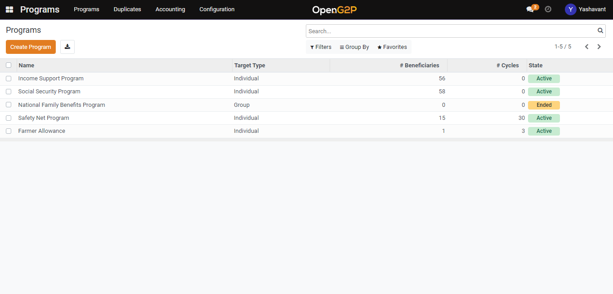

# Create Deduplication Manager under Program

## Description

This guide provides steps to create and configure the deduplication manager inside the program.

## Pre-requisites

The user must have the Program Manager role.

## Steps

1. Navigate to _Programs_ using the menu bar.

<figure><figcaption></figcaption></figure>

2. Click on the program name for which configuration to be done.

<figure><figcaption></figcaption></figure>

3. Navigate to the _Configuration_ section on Program detailed view page.

<figure><figcaption></figcaption></figure>

4. Click on _Add a line_ in the _Deduplication Manager_ section.

<figure><figcaption></figcaption></figure>

5. Click on the _Create_ button on the Add: Deduplication Managers pop-up window.

<figure><figcaption></figcaption></figure>

6. Select the deduplication manager type.

<figure><figcaption></figcaption></figure>

7. Once the name is provided to the deduplication manager, Create and Edit buttons will appear to click on Create and Edit button to create a deduplication manager.&#x20;

<figure><figcaption></figcaption></figure>

8. Select the ID type from the Supported ID Document Types drop-down.

<figure><figcaption></figcaption></figure>

9. Click on the _Save_ button and then click on the _Save & Close_ button which will save the deduplication manager to that program under configuration.

<figure><figcaption></figcaption></figure>
