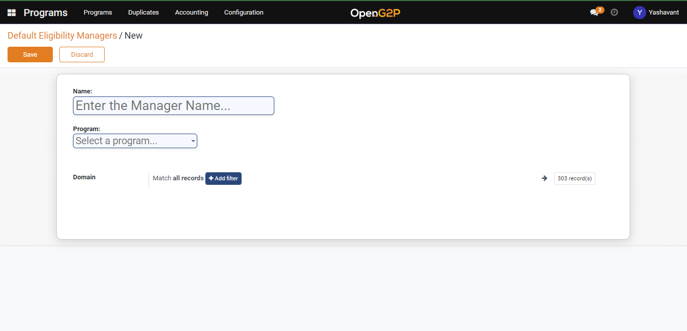
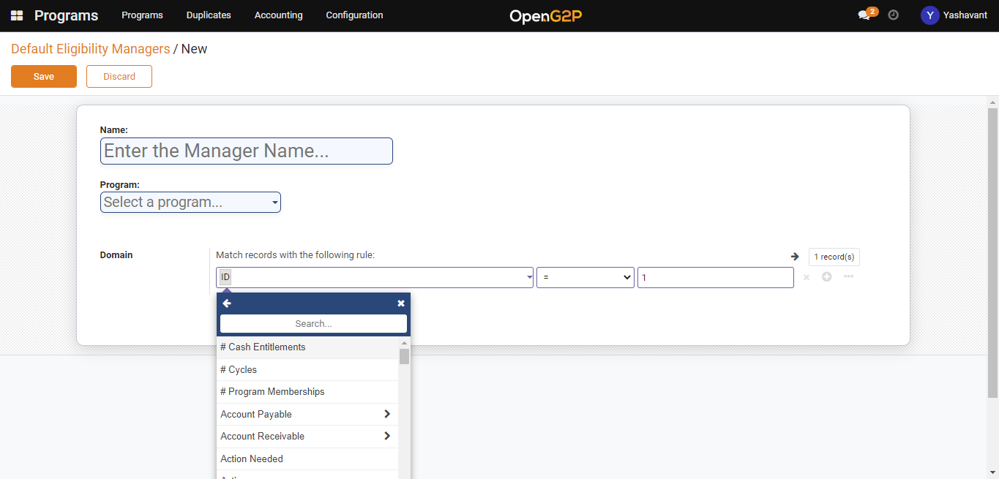

# Copy of Create ID Document Eligibility manager

## Description

This guide provides the steps to create an ID document eligibility manager

## Pre-requisites

user should have a Program Manager role.

## Steps

1. Navigate to Programs using the menu bar.

<figure><figcaption></figcaption></figure>

2. Click on Configuration and then on ID document Eligibility Manager.&#x20;

<figure><figcaption></figcaption></figure>

3. Click Create a button on the ID document eligibility manager list view page.

<figure><figcaption></figcaption></figure>

4. Provide the name for the eligibility manager and select the program name from the drop-down for which the eligibility manager is created.

<figure><figcaption></figcaption></figure>

4. Use _+Add filter_ to set eligibility criteria using [Domain Filters](../../../modules/program-management/eligibility.md#domain-filters). You may specify multiple eligibility criteria.

<figure><figcaption></figcaption></figure>

5. Click the Save button to save the eligibility manager and it will be listed under the eligibility manager list view page.&#x20;
