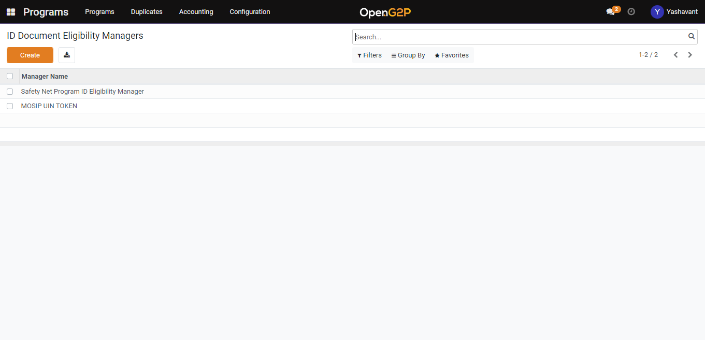

# Create ID Document Eligibility Manager

## Description

This guide provides the steps to create an ID document eligibility manager

## Pre-requisites

user should have a Program Manager role.

## Steps

1. Navigate to _Programs_ using the menu bar.

<figure><figcaption></figcaption></figure>

2. Click on _Configuration_ and then on _ID document Eligibility Manager._&#x20;

<figure><figcaption></figcaption></figure>

3. Click _Create_ a button on the ID document eligibility manager list view page.

<figure><figcaption></figcaption></figure>

4. Provide the name for the eligibility manager and select the program name from the drop-down for which the eligibility manager is created.

<figure><figcaption></figcaption></figure>

5. Click the _Save_ button to save the eligibility manager and it will be listed under the eligibility manager list view page.&#x20;

<figure><figcaption></figcaption></figure>
