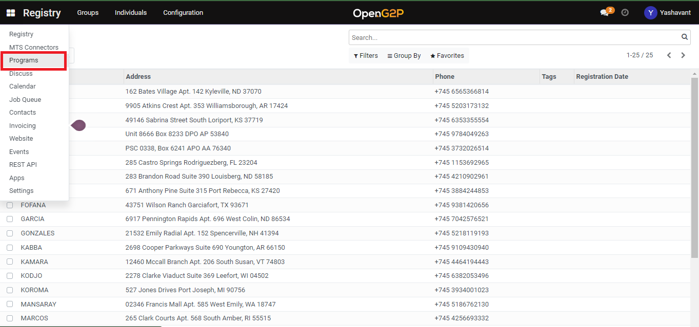
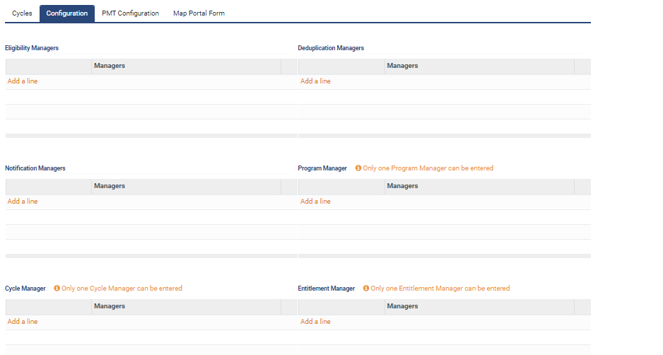

# Create Default Eligibility Manager

## Description

This guide provides the steps to create a default eligibility manager

## Pre-requisites

user should have a Program Manager role.

## Steps

1. Navigate to _Programs_ using the menu bar.

<figure><figcaption></figcaption></figure>

2. Click on _Configuration_ and then on _Default Eligibility Manager._

<figure><figcaption></figcaption></figure>

3. Click _Create_ a button on the default eligibility manager list view page.

<figure><figcaption></figcaption></figure>

4. Provide the name for the eligibility manager and select the program name from the drop-down for which the eligibility manager is created.

<figure><figcaption></figcaption></figure>

4. Use _+Add filter_ to set eligibility criteria using [Domain Filters](broken-reference). You may specify multiple eligibility criteria.

<figure><figcaption></figcaption></figure>

5. Click the _Save_ button to save the eligibility manager and it will be listed under the eligibility manager list view page.
