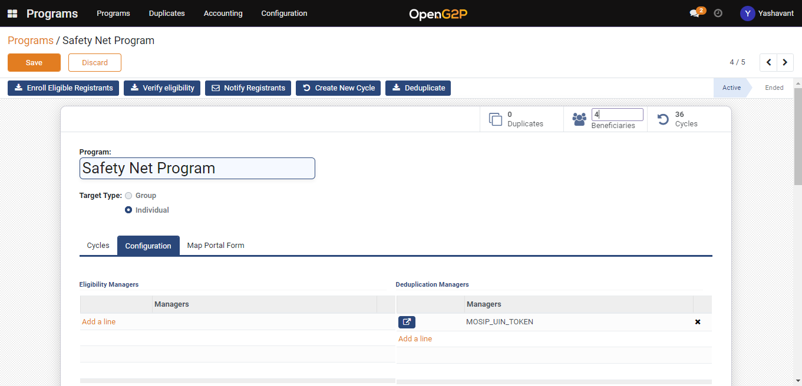
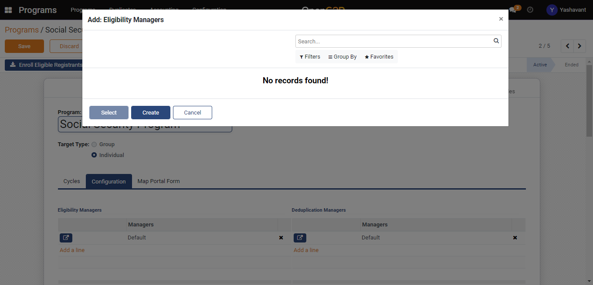
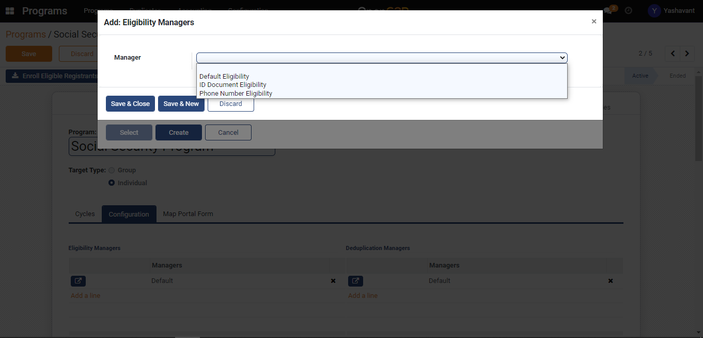
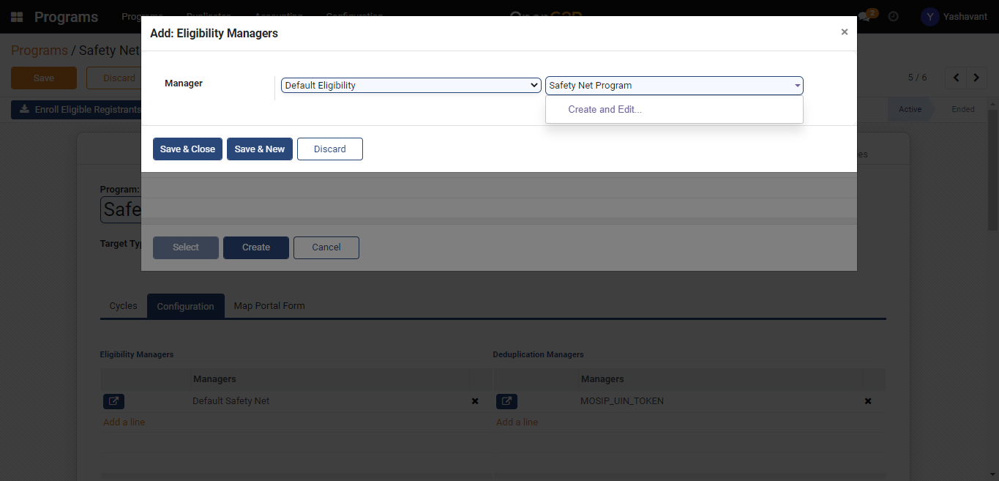
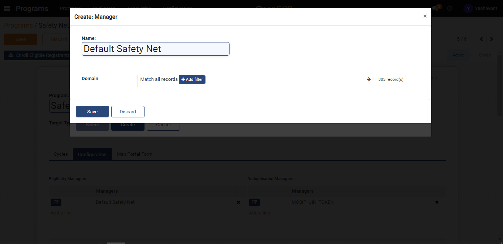
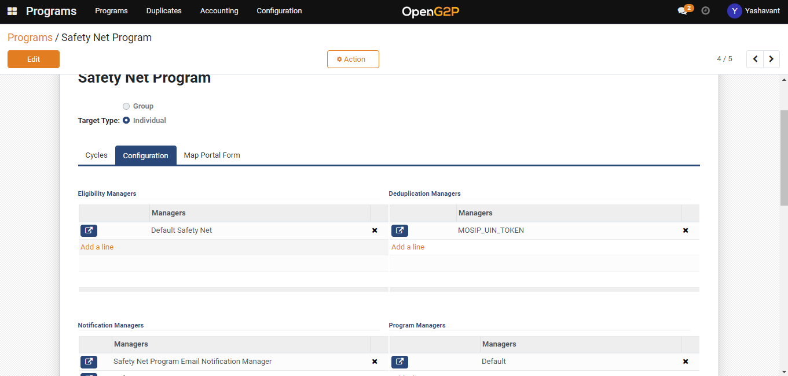

# Create Eligibility Manager under Program

## Description

This guide provides steps to create and configure the eligibility manager inside the program.

## Pre-requisites

The user must have the Program Manager role.

## Steps

1. Navigate to _Programs_ using the menu bar.

<figure><figcaption></figcaption></figure>

2. Click on the program name for which configuration to be done.

<figure><figcaption></figcaption></figure>

3. Navigate to the _Configuration_ section on Program detailed view page.

<figure><figcaption></figcaption></figure>

4. Click on _Add a line_ in the _Eligibility Manager_ section.

<figure><figcaption></figcaption></figure>

5. Click on the _Create_ button on the Add: Eligibility Managers pop-up window.

<figure><figcaption></figcaption></figure>

6. Select the eligibility manager type.

<figure><figcaption></figcaption></figure>

7. Once the name is provided to the eligibility manager, _Create_ and _Edit_ buttons will appear. Click on _Create and Edit_ button to create an eligibility manager.

<figure><figcaption></figcaption></figure>

8. Set the eligibility criteria's using Add Filter button on the creation page.

<figure><figcaption></figcaption></figure>

9. Click on the Save button and then click on the _Save & Close_ button which will save the eligibility manager to that program under configuration.

<figure><figcaption></figcaption></figure>
