# Create Custom Entitlement Manager Group

## Description

This guide provides steps to create a custom entitlement manager group and add the users to this group. Users included in this group get the group's access rights and permissions.

## Pre-requisites

The user must have a Program Administrator role. See the [Create User and Assign Role](assign-roles-to-users.md) guide.

## Steps

1. Navigate to _Settings_ using the menu bar.

<figure><figcaption></figcaption></figure>

2. Click on _Activate the developer mode._

<figure><figcaption></figcaption></figure>

3. Click on the _Users and Companies_ menu and navigate to _Groups_.

<figure><figcaption></figcaption></figure>

4. Click on _Create_.

<figure>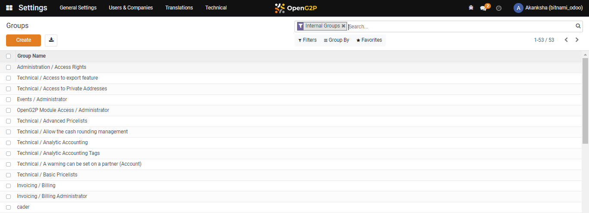<figcaption></figcaption></figure>

5. Select _Application_. In the figure below, _Openg2p Module Access_ was selected from the drop-down list. Add the Name.

<figure>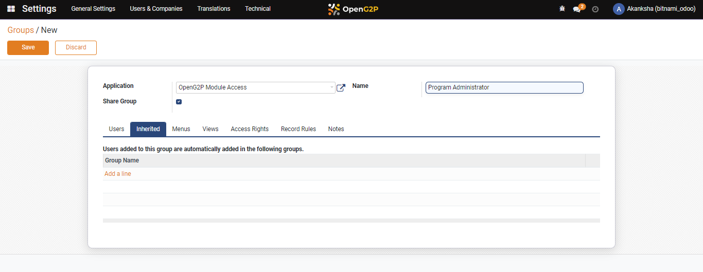<figcaption></figcaption></figure>

6. Tick the check box _Share Group_ if you want to allow users of this group to grant additional access to other users who might not be in the original group.

<figure>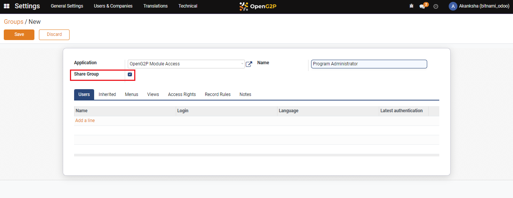<figcaption></figcaption></figure>

7. To add users to this group, click on _Add a Line._ A pop-up window appears to allow the selection of the users from a list. You can view and manage the users assigned to the group.

<figure>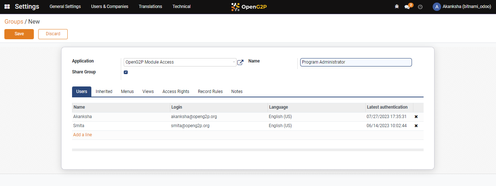<figcaption></figcaption></figure>

 

<figure>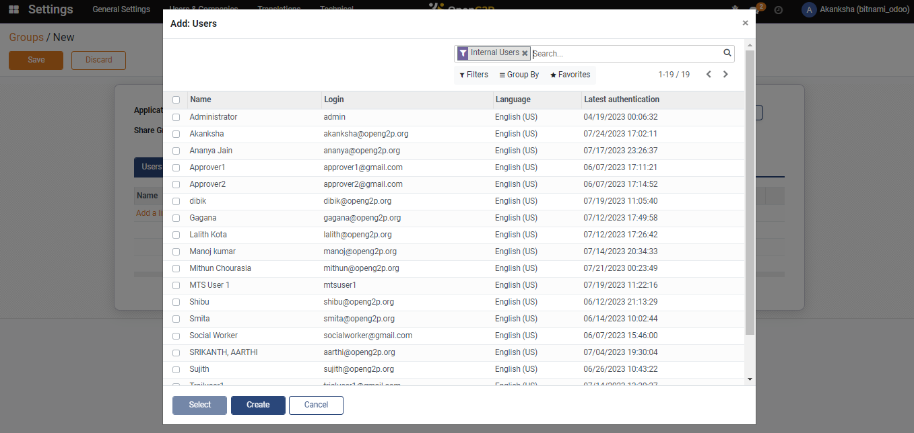<figcaption></figcaption></figure>

8. Select _OpenG2P ModuleAccess / Administrator_ as _Group Name_ in the _Inherited_ tab and click on _Add a Line._ A pop-up window shows a list of groups to select from. This group will get the access rights of the _OpenG2P ModuleAccess / Administrator_ group, and the users added to this group will be automatically added to the _OpenG2P ModuleAccess / Administrator_ group.

<figure>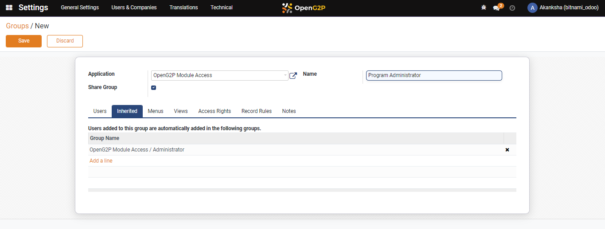<figcaption></figcaption></figure>

 

<figure>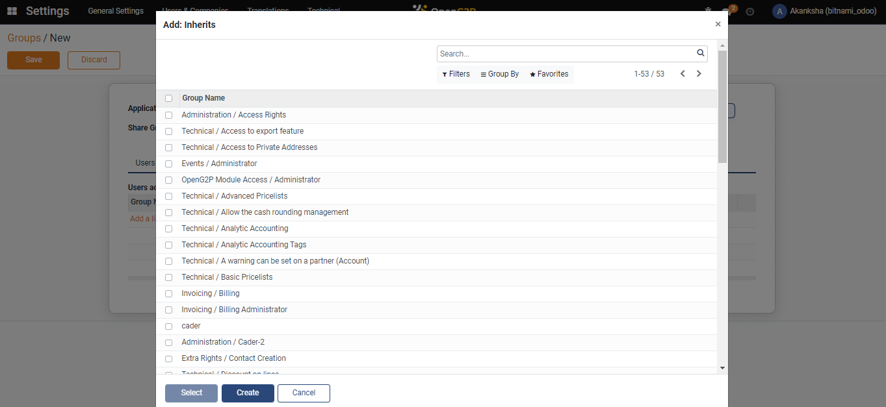<figcaption></figcaption></figure>

9. Select the _Menus_ tab and click on _Add a Line_. A pop-up window shows a list of menus to select from. These menu options provide access to multiple modules and their functionality.

<figure>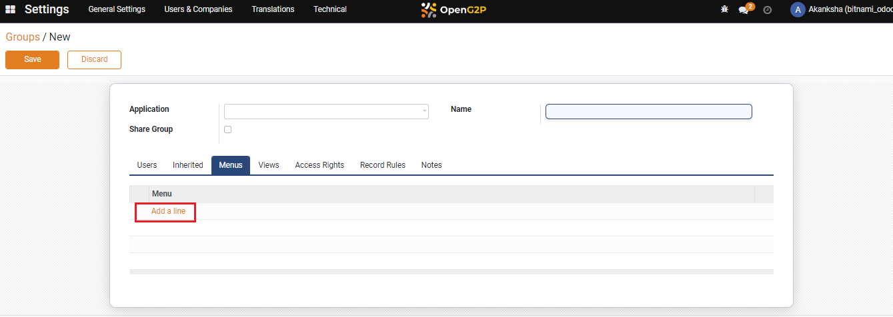<figcaption></figcaption></figure>

 

<figure><figcaption></figcaption></figure>

10. Select the _Views_ tab and click on _Add a Line_. A pop-up window shows the list of views to select from. A view represents various screens and forms used in the user interface.

<figure>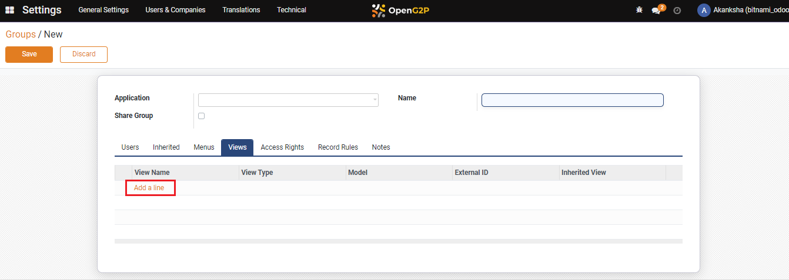<figcaption></figcaption></figure>

 

<figure>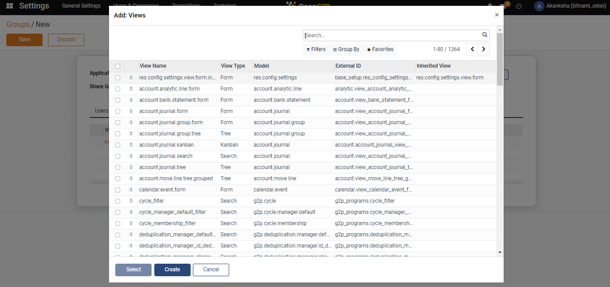<figcaption></figcaption></figure>

11. Select the _Access Rights_ tab and click on _Add a Line._ Enter the name, and select the model from the drop-down. Tick one or more checkboxes for the relevant access options - _None_, _Read Access_, _Write Access_, _Create Access_, and _Delete Access_.

<figure>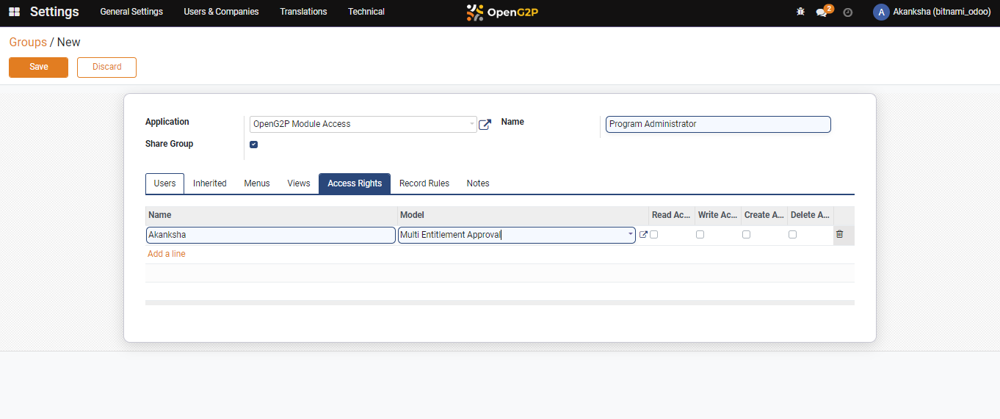<figcaption></figcaption></figure>

12. Select the _Record Rules_ tab. This tab allows you to set up certain rules and access rights that can be configured within specific modules.
13. Optionally select the _Notes_ tab to add any additional notes or remarks about the setup or group's configuration.
14. Click on _Save._ A new entitlement approval group gets created.
