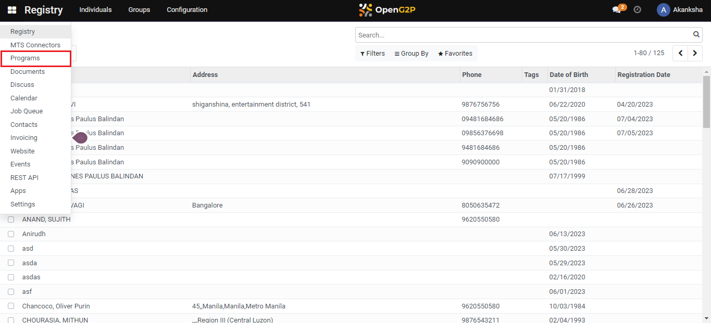
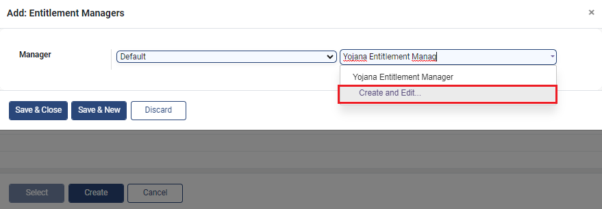
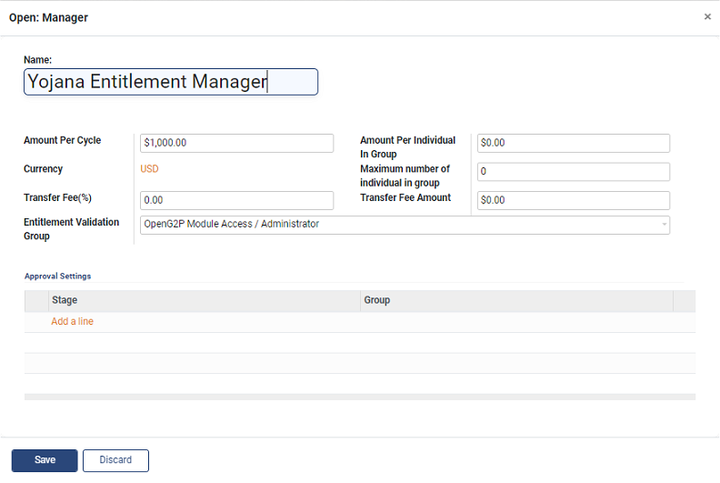
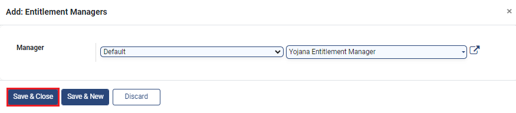
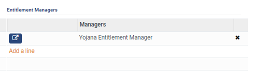

# Configure Entitlement Manager under Program

## Description

This guide provides steps to configure an entitlement manager in the program.

## Pre-requisites

The user must have the Program Administrator role.

## Steps

1. Navigate to _Programs_ using the menu bar.

<figure><figcaption></figcaption></figure>

2. Select the desired program to configure.

<figure><figcaption></figcaption></figure>

3. Navigate to the _Configuration_ section on the program's detailed view page.

<figure><figcaption></figcaption></figure>

4. Click on _Add a Line_ in the _Entitlement Managers_ section.

<figure><figcaption></figcaption></figure>

5. A pop-up window appears. Click on _Create._

<figure><figcaption></figcaption></figure>

6. Another pop-up window appears. Select the desired manager type (_Default/Voucher)_ from the _Manager_ drop-down.

<figure><figcaption></figcaption></figure>

7. Another drop-down appears beside the _Manager_ drop-down. Enter a name for the entitlement manager and select _Create and Edit_.

<figure><figcaption></figcaption></figure>

8. Another dialogue box appears. Configure the entitlement manager details as described in the [Create Entitlement Manager Type](create-entitlement-manager-type/) guide.&#x20;

<figure><figcaption></figcaption></figure>

9. Click on _Save_.
10. The manager gets added, click on _Save and Close_.

<figure><figcaption></figcaption></figure>

11. In the _Entitlement Manager_ section, an entitlement manager is created.

<figure><figcaption></figcaption></figure>
