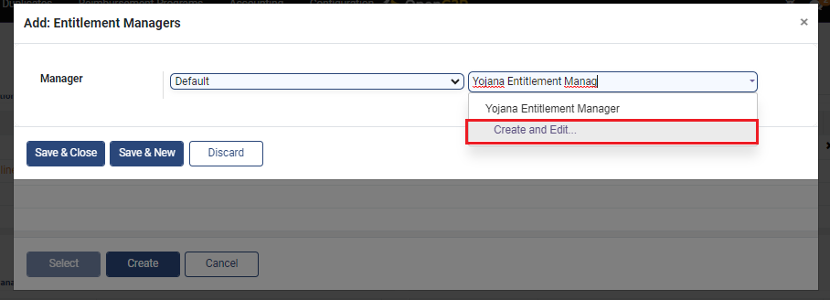

# Create Entitlement Manager Type

## Description

This guide provides steps to create a default entitlement manager type. There are 2 types of entitlement managers available that can be created and configured in a program.

1. Default Entitlement Manager
2. Voucher Entitlement Manager

## Pre-requisites

The user must have the Program Administrator role.

## Steps

1. Navigate to _Programs_ using the menu bar.

<figure><figcaption></figcaption></figure>

2. Select the desired program to configure.

<figure><figcaption></figcaption></figure>

3. Navigate to the _Configuration_ section on the program's detailed view page.

<figure><figcaption></figcaption></figure>

4. Click on _Add a Line_ in the _Entitlement Managers_ section.

<figure><figcaption></figcaption></figure>

5. A pop-up window appears. Click on _Create._

<figure><figcaption></figcaption></figure>

6. Another pop-up window appears. Select _Default_ from the _Manager_ drop-down.

<figure><figcaption></figcaption></figure>

7. Another drop-down appears beside the _Manager_ drop-down. Enter a name for the entitlement manager and select _Create and Edit_.

<figure><figcaption></figcaption></figure>

8. Another pop-up window appears. Select the relevant group from the _Entitlement Validation Group_ drop-down list and add the approval settings.
9. Click on _Save_.

<figure><figcaption></figcaption></figure>

10. The manager gets added, click on _Save and Close_.

<figure><figcaption></figcaption></figure>

11. In the _Entitlement Manager_ section, an entitlement manager is created.

<figure><figcaption></figcaption></figure>
