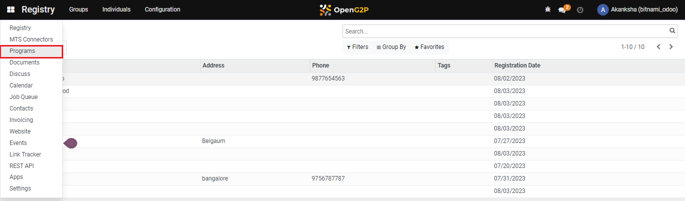
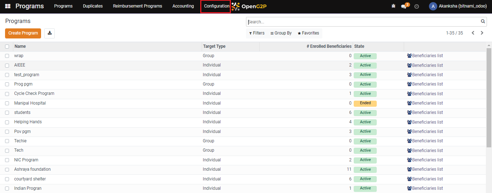
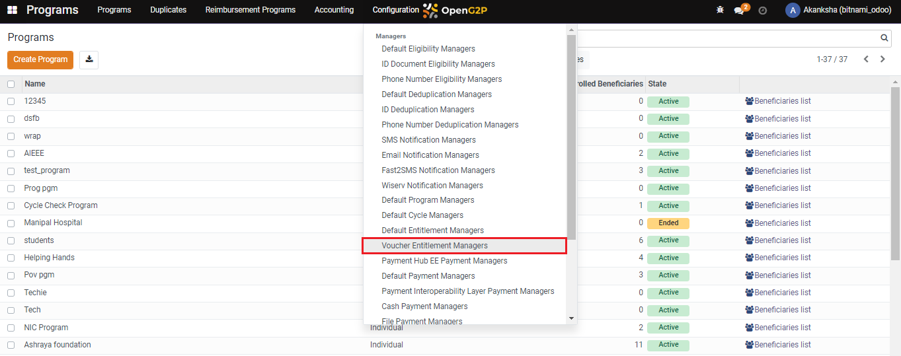
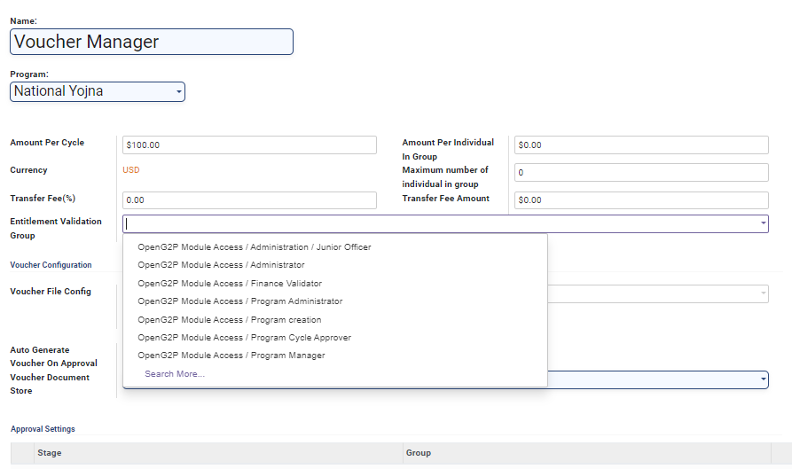
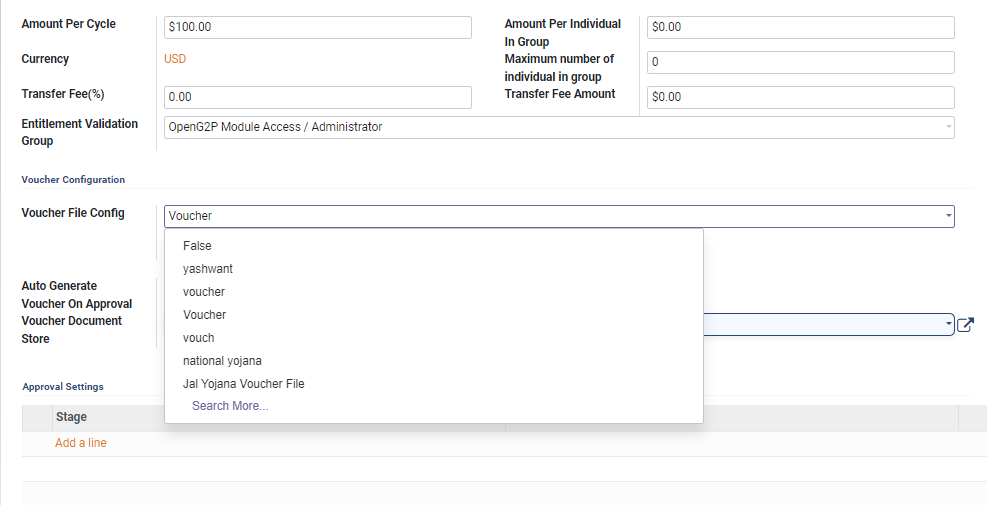
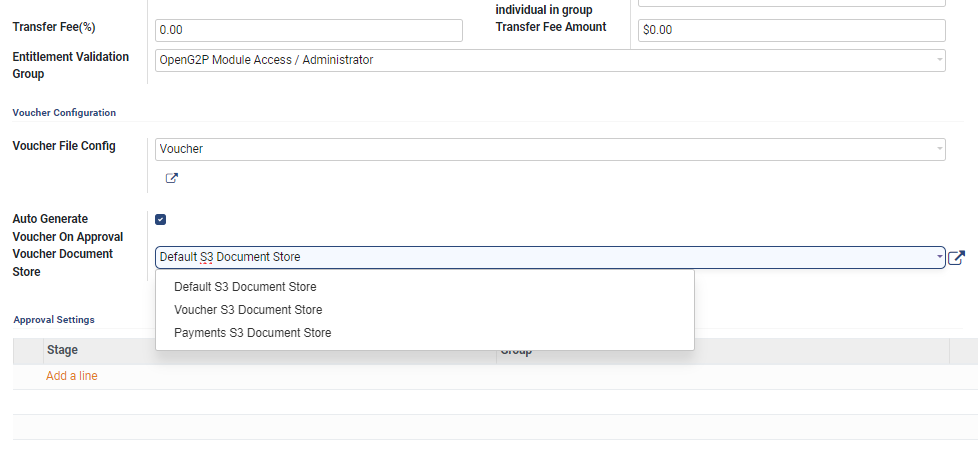
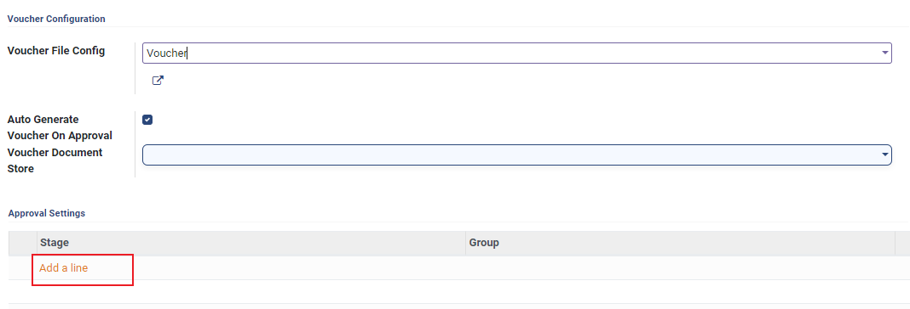
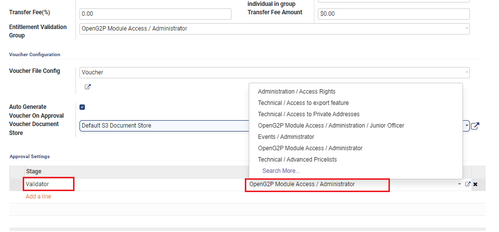
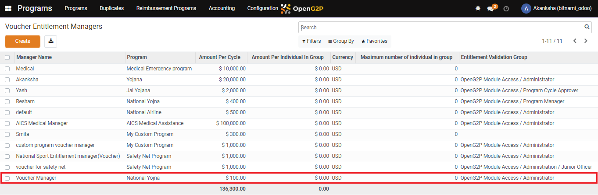

# Create Voucher Entitlement Manager

## Description

This guide provides steps to create the voucher entitlement manager.

## Pre-requisites

The user must have the Program Administrator role.

## Steps

1. Navigate to _Programs_ using the menu bar.

<figure><figcaption></figcaption></figure>

2. Click on _Configuration_.

<figure><figcaption></figcaption></figure>

3. Select _Voucher Entitlement Managers_ from the drop-down list.

<figure><figcaption></figcaption></figure>

4. Click on _Create_.

<figure><figcaption></figcaption></figure>

5. Enter the details.

* _Name:_ Enter the name of the manager.
* _Program:_ Select the program from the drop-down list.
* _Amount Per Cycle:_ Enter the amount per cycle.
* _Amount Per Individual in Group:_ Enter the amount each individual in the group is entitled to.
* _Currency:_ Enter the currency used for transactions
* _Maximum Number of Individual in Group:_ Enter the maximum group members.
* _Transfer Fee (%):_ Enter the percentage of fees required for carrying out the transactions
* _Transfer Fee Amount:_ Enter the amount required for carrying out the transactions
* _Entitlement Validation Group:_ Select the validation group from the drop-down list.

<figure><figcaption></figcaption></figure>

6. Click the _Voucher File Config_ and select the voucher file from the drop-down list. To learn the steps to create a voucher file, follow the guide [Create Entitlement Voucher Template](../create-entitlement-voucher-template.md).

<figure><figcaption></figcaption></figure>

7. Click the _Voucher Document Store and select the file from_ the drop-down list.

<figure><figcaption></figcaption></figure>

8. If you want to add multiple managers for entitlement approval then click on _Add a Line_ in the _Approval Settings_ section\_.\_

**Note:** This step and the next step should be skipped if multiple managers are not required for entitlement approval.

<figure><figcaption></figcaption></figure>

9. Enter the name for the stage and select the _Group_ from the drop-down list.

<figure><figcaption></figcaption></figure>

10. Click on _Save_.

<figure><figcaption></figcaption></figure>

11. The manager gets added to the list.

<figure><figcaption></figcaption></figure>
