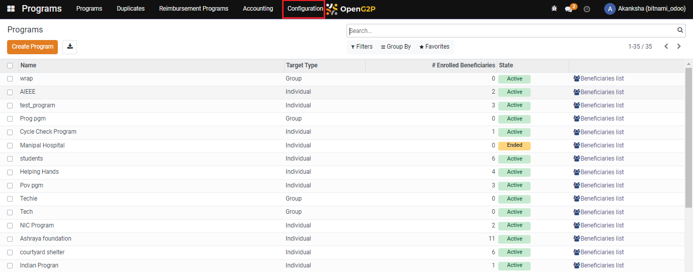
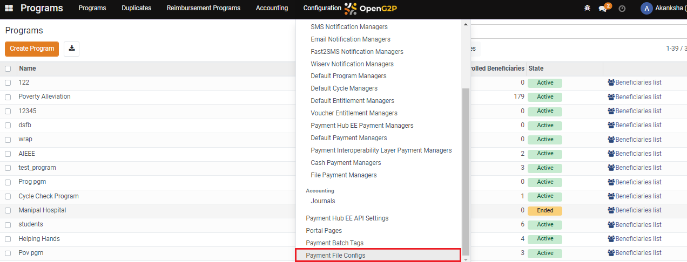
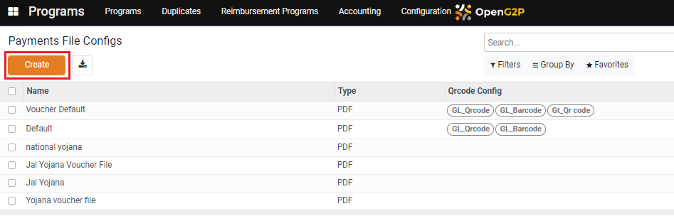
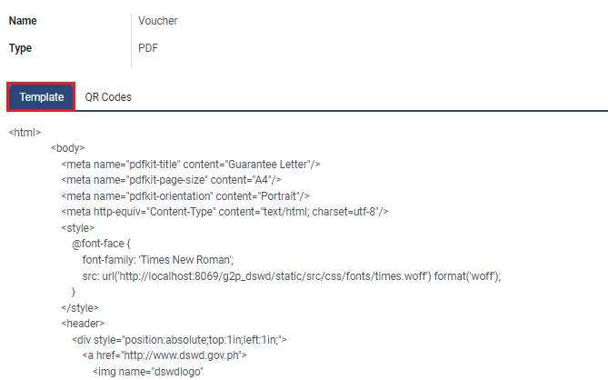
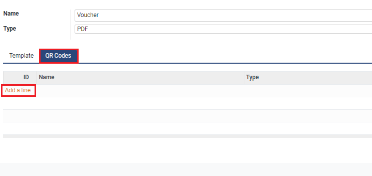
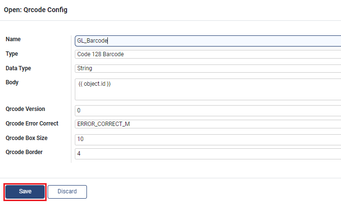
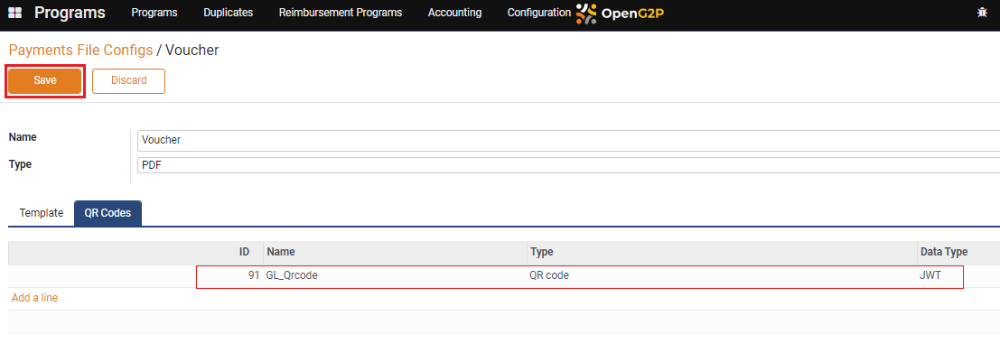

# Create Entitlement Voucher Template

## Description

This guide provides steps to create an entitlement voucher template. The user can use this file to configure a voucher entitlement manager.

## Pre-requisites

The user must have the Program Administrator role.

## Steps

1. &#x20;Navigate to _Programs_ using the menu bar.

<figure><figcaption></figcaption></figure>

2. &#x20;Click on _Configuration._

<figure><figcaption></figcaption></figure>

3. &#x20;Select _Payment File Configs_ from the drop-down list.

<figure><figcaption></figcaption></figure>

4. &#x20;Click the _Create_ button to view the _Payments File Configs_ creation page.

<figure><figcaption></figcaption></figure>

5. &#x20;The view allows to configure the  _Payments File Template_.

* _Name:_ Name of the Payments File Configuration
* _Type:_ Type of Document&#x20;

<figure><figcaption></figcaption></figure>

6. &#x20;Click on _Template_ and add the HTML code.

<figure><figcaption></figcaption></figure>

7. &#x20;Click on _QR Codes_ and then on _Add a Line._

<figure><figcaption></figcaption></figure>

8. &#x20;A pop-up window _Qrcode Config_ appears.

* _Name_: Name of the QR Code
* _Type_: Type of QR Code
* _Data Type_: The type of code that will be embedded in the QR Code
* _Body_: Code as per the data type
* _Qrcode Version:_ QR Code version&#x20;
* _Qrcode Error Correct:_ QR Code error correction level (L/M/Q/H)
* _Qrcode Box Size:_ QR Code box size
* _Qrcode Border:_ Number of borders in the QR Code

9. &#x20;Click on _Save_.

<figure><figcaption></figcaption></figure>

10. &#x20;The file gets added, click on _Save_.&#x20;

<figure><figcaption></figcaption></figure>
