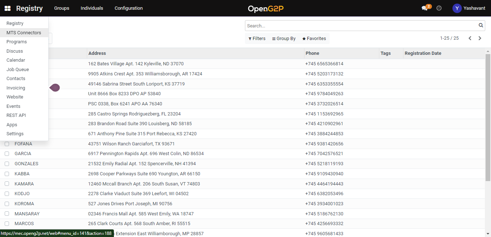
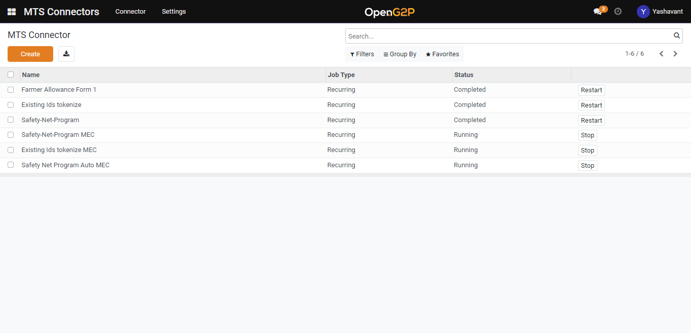
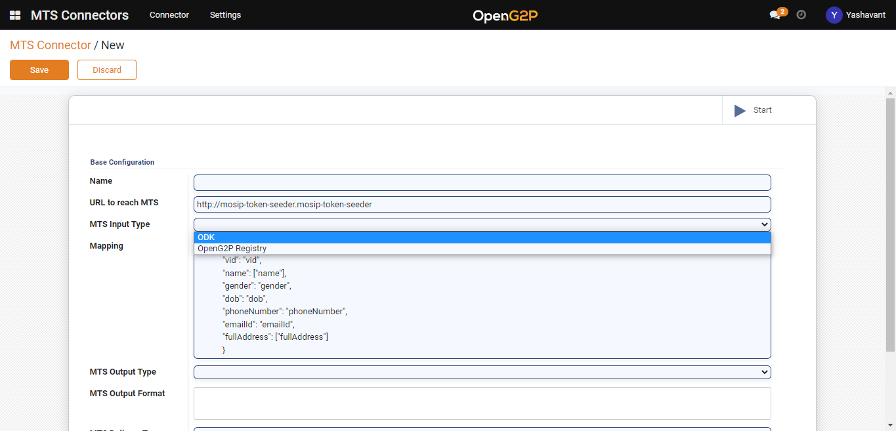

# Create ODK MTS Connector

## Description

This Guide will help to create the [ODK MTS Connector](broken-reference).

## Pre-requisites

* The user must have a Program Manager role.
* ODK form should be available.

## Steps

1. Navigate to the _MTS Connectors_ using the menu bar.

<figure><figcaption></figcaption></figure>

2. Navigate to the MTS Connector creation page by clicking the _Create_ button on the MTS Connector list view page.

<figure><figcaption></figcaption></figure>

3. Set _MTS Input Type_ as _ODK_ and for other fields configuration please go through [ODK MTS Connector Configuration](broken-reference).

<figure><figcaption></figcaption></figure>

4. Click the _Save_ button and the connector will be listed under the MTS Connectors list view page.
5. Click on _Start_ in the MTS Collectors list view page to start the created connector.
