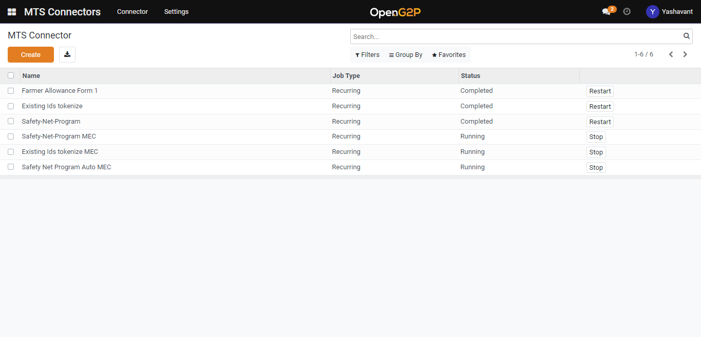

# Create OpenG2P Registry MTS Connector

## Description

This Guide will help to create the [OpenG2P registry MTS Connector](broken-reference).

## Pre-requisites

The user must have a Program Manager role.

## Steps

1. Navigate to the _MTS Connectors_ using the menu bar.

<figure><figcaption></figcaption></figure>

2. Navigate to the MTS Connector creation page by clicking the _Create_ button.

<figure><figcaption></figcaption></figure>

3. Set _MTS Input Type_ as _OpenG2P Registry_ and for other fields configuration please go through [Registry MTS Connector](broken-reference).

<figure><figcaption></figcaption></figure>

4. Click on the _Start_ button under the MTS Connectors list view page to start the created connector.
5. Click the _Save_ button and the connector will be listed under the MTS Connectors list view page.
