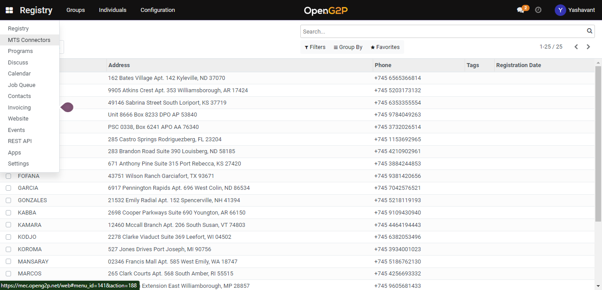
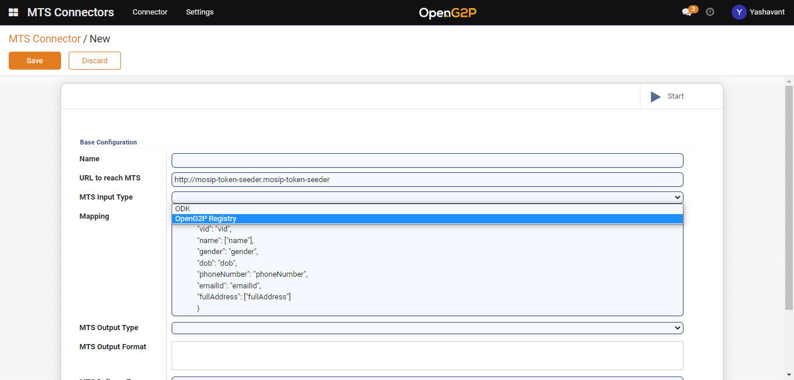

# Create OpenG2P Registry MTS Connector.

## Description

This Guide will help to create the [OpenG2P registry MTS Connector](../../../integrations/integration-with-mosip/registry-mts-connector.md).

## Pre-requisites&#x20;

The user must have a Program Manager role.

## Steps

1. Navigate to the _MTS Connectors_ using the menu bar.

<figure><figcaption></figcaption></figure>

2. Navigate to the MTS Connector creation page by clicking the _Create_ button on the MTS Connector list view page.

<figure><figcaption></figcaption></figure>

3. Set _MTS Input Type_ as _OpenG2P Registry_ and for other fields configuration please go through [Registry MTS Connector](../../../integrations/integration-with-mosip/registry-mts-connector.md).

<figure><figcaption></figcaption></figure>

4. Click on _Start_ in the MTS Collectors list view page to start the created connector.
5. Click the Save button and the connector will be listed under the MTS  Connectors list view page.
