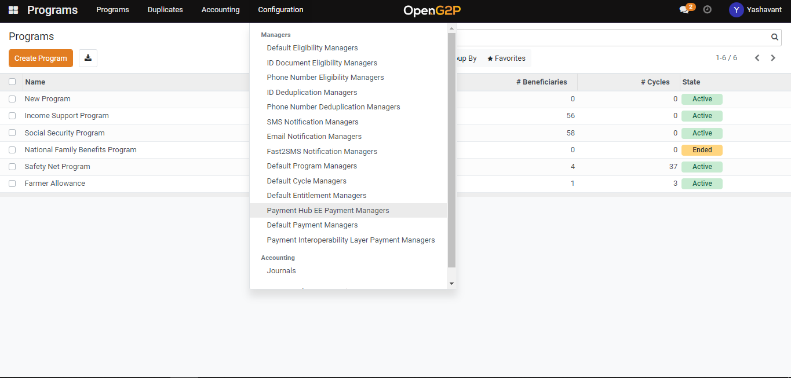
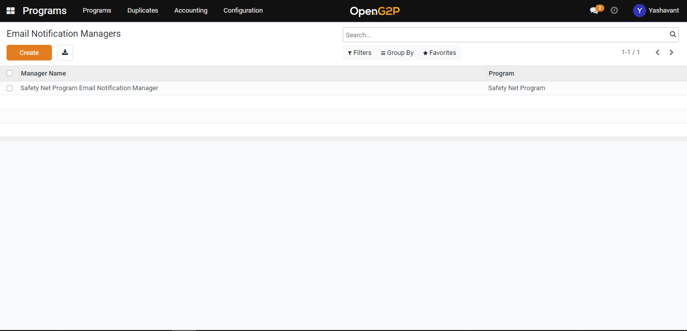

# Create Email Notification Manager

## Description

This guide will provide the steps to create an Email notification manager.

## Pre-requisites

The user should have a Program Manager role assigned.

## Steps

1. Navigate to _Programs_ using the menu bar.

<figure><figcaption></figcaption></figure>

2. Click on _Configuration_ and then on _Email Notification Manager._

<figure><figcaption></figcaption></figure>

3. Click the _Create_ button to navigate to the email notification manager creation page.

<figure><figcaption></figcaption></figure>

4. Email notification manager creation page

* _Name_: Provide a name for the manager
* _Program_: Select the program from the drop-down for which the manager is created
* _On Enrolled In Program Template_: Select the template from the drop-down for program enrolment notification.
* _On Cycle Started Template:_ Select the template from the drop-down for the program cycle started notification.
* _On Cycle Ended Template_: Select the template from the drop-down for the program cycle-ended notification.
* Select _Send Immediately_ to send the email notification to beneficiaries after the program enrollment, at the start of the cycle, and at the end of a cycle.

<figure><figcaption></figcaption></figure>

5. After clicking on the _Save_ button notification will be saved under the email notification manager list view page.
