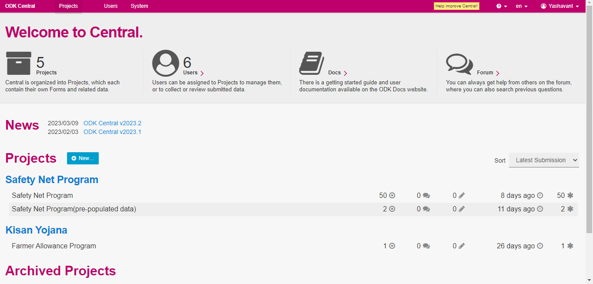
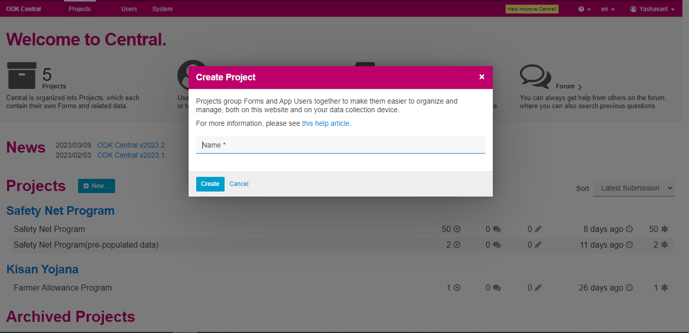
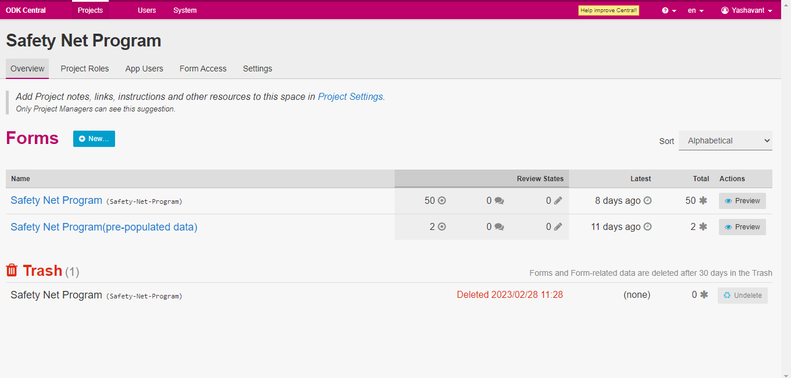
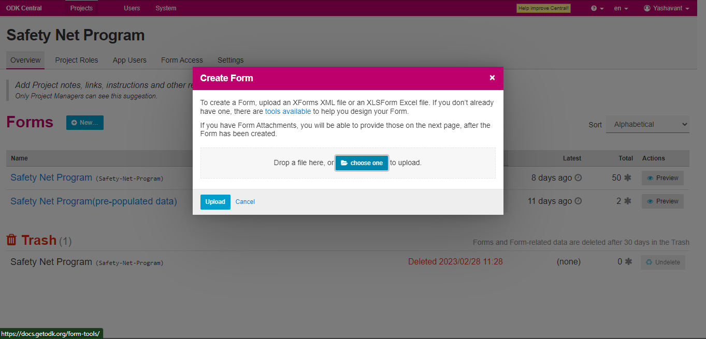
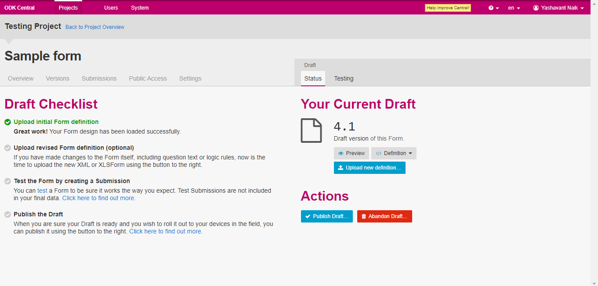

# Create ODK Form

## Description

This guide provides steps to create a new ODK form for a program.

## Pre-requisites

* [ODK Central](https://docs.getodk.org/central-intro/) should be deployed and available.
* The user should have an Administrator role in ODK Central. See [Create User and Assign Role](assign-roles-to-users.md) guide.

## Steps

1. Login to ODK Central.&#x20;
2. Click on the +_New_ button to create a new project

<figure><figcaption></figcaption></figure>

2. &#x20;Provide the project name same as the program name for which creating the form.

<figure><figcaption></figcaption></figure>

3. Once the project is created and listed on the ODK home page, click on the project name.
4. Click on the +_New_ button on the project overview page to create a new form.

<figure><figcaption></figcaption></figure>

5. Choose a file which has form values and upload it.

<figure><figcaption></figcaption></figure>

6. Once the form file is uploaded it will be in draft status. Click on _Publish_ _Draft_ to publish the form.

<figure><figcaption></figcaption></figure>

7. Once the draft is published it will be listed under the project overview.
