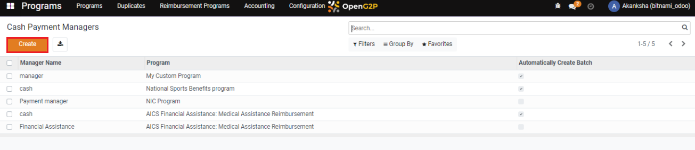
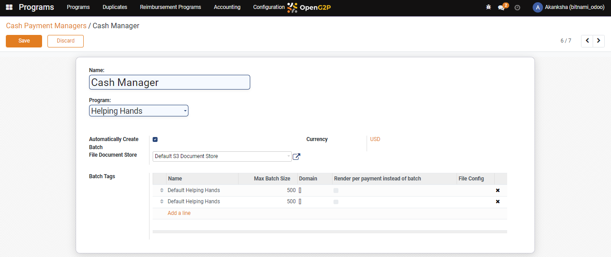

# Create Cash Payment Manager

## Description

This guide provides the steps to configure the cash payment manager for the program.

## Pre-requisites

The user should have a Program Manager role.

## Steps

1. Navigate to _Programs_ using the menu bar.

<figure><figcaption></figcaption></figure>

2. Click on _Configuration_.

<figure><figcaption></figcaption></figure>

3. Navigate to _Cash Payment Managers_ from the drop-down list.

<figure><figcaption></figcaption></figure>

4. Click on _Create_.

<figure><figcaption></figcaption></figure>

5. Enter the _Name_, Select the _Programs_ from the drop-down list, check the box if the user wants it to be an _Automatically Created Batch_, and choose _File Document Store_ from the drop-down list.

<figure><figcaption></figcaption></figure>

Note: To avoid creating an automatic batch, follow these steps. Alternatively, if you wish to create an automatic batch, follow the steps beginning with serial number nine.

6. If the user doesn't check the box, by default, the _Payment File Configuration_ appears. Click on _Add a Line._

<figure><figcaption></figcaption></figure>

7. Select the file and click on _Select_.

<figure><figcaption></figcaption></figure>

8. Click on _Save_.

<figure><figcaption></figcaption></figure>

9. The _Batch Tags_ field appears if the user checks the box _Automatically Create Batch._
10. Click on _Add a Line_.

<figure><figcaption></figcaption></figure>

11. Click on _Create._

<figure><figcaption></figcaption></figure>

12. A new pop-up window appears. Enter the details and select the configured file from the file drop-down list in the _File Config_ field.

<figure><figcaption></figcaption></figure>

13. Click on _Save_.

<figure><figcaption></figcaption></figure>

14. A new cash payment manager will be created and added to the list.

<figure><figcaption></figcaption></figure>
