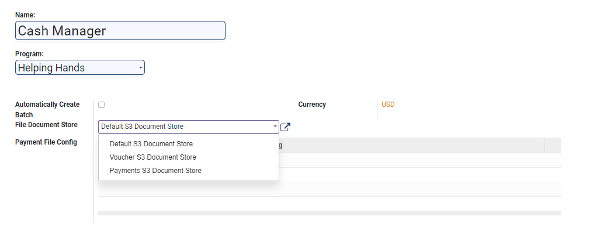

# Create Cash Payment Manager

## Description

This guide provides the steps to configure the cash payment manager.

## Pre-requisites

The user should have a Program Administrator role.

## Steps

1. Navigate to _Programs_ using the menu bar.

<figure><figcaption></figcaption></figure>

2. Click on _Configuration_.

<figure><figcaption></figcaption></figure>

3. Select _Cash Payment Managers_ from the drop-down list.

<figure><figcaption></figcaption></figure>

4. Click on _Create_.

<figure><figcaption></figcaption></figure>

5. Enter the details

* _Name:_ Enter the name of the manager.
* _Program:_ Select the program from the drop-down list
* _Automatically Created Batch:_ Check the box if the user wants to create automatic batches.
* Currency: Enter the currency.
* _File Document Store:_ Select the file from the drop-down list.
* _Payment File Config:_ The payment file is configured based on the state of the _Automatically Created Batch_ checkbox:

Disabled: Only one payment file is associated with this payment manager and configured using the _Payment File Config_ dropdown.&#x20;

Enabled: Each batch has one payment file configured as part of the _Batch Tags_ configuration. In this case, the _Batch Tags_ configuration replaces the _Payment File Config dropdown._&#x20;

<figure><figcaption></figcaption></figure>

6. If the checkbox _Batch Tags_ is enabled, then go to step#9, else click on _Add a Line_ under the _Payment File Configuration_ to configure the payment file.

<figure><figcaption></figcaption></figure>

7. Select the file and click on _Select_.

<figure><figcaption></figcaption></figure>

8. Click on _Save_.

<figure><figcaption></figcaption></figure>

9. If the checkbox _Automatically Create Batch_ is disabled, then go to step#15, else click on _Add a Line_ in _Batch Tags_ configuration.

<figure><figcaption></figcaption></figure>

11. Click on _Create._

<figure><figcaption></figcaption></figure>

12. A new pop-up window appears. Enter the details.

* _Name_:  Enter the name for batch tags.
* _Order_: Enter the order number for the batch.
* _Domain:_ Add the domain filter by clicking on the _+Add filter._
* _Max Batch Size_: Enter the maximum size for the batch
* _Render per payment instead of batch_: Check the box if you want to render payments individually instead of batch.
* _File Config:_ Select the configured file from the file drop-down list.

<figure><figcaption></figcaption></figure>

13. Click on _Save and Close._

<figure><figcaption></figcaption></figure>

14. Click on _Save._

<figure><figcaption></figcaption></figure>

15. A new cash payment manager will be created and added to the list.

<figure><figcaption></figcaption></figure>
