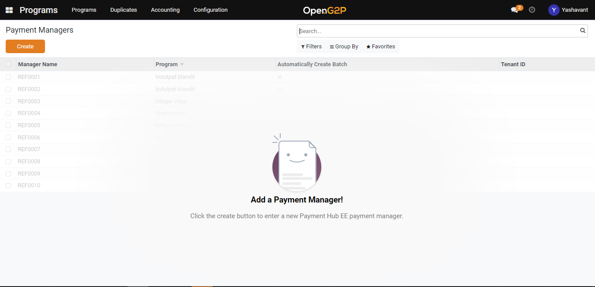
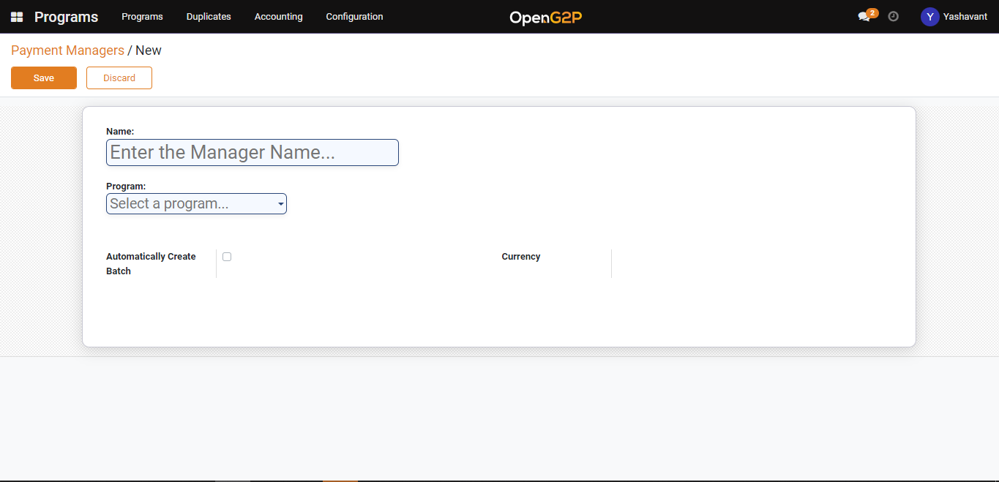

# Create Default Payment Manager

## Description

This guide provides the steps to create a Default Payment Manager.

## Pre-requisites

The user should have a Program Manager role.

## Steps

1. Navigate to _Programs_ using the menu bar.

<figure><figcaption></figcaption></figure>

2. Click on Configuration and then on Payment Interoperability Layer Payment Manager.&#x20;

<figure><figcaption></figcaption></figure>

3. Click on Create button which will navigate to the Default Payment Manager creation page.

<figure><figcaption></figcaption></figure>

4. In the payment manager creation page provide a name for the payment manager, select the program name, select Automatically Create batch if required and select the Currency.

<figure><figcaption></figcaption></figure>

5. Once the payment manager is saved it will be listed under the payment manager list view page which further can be used under the program configuration for which it was created.

<figure><figcaption></figcaption></figure>

