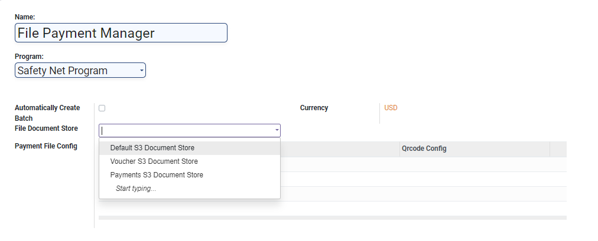
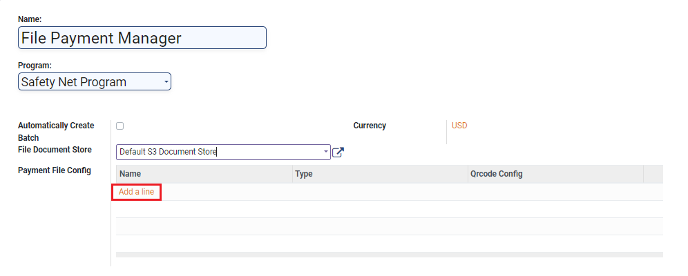
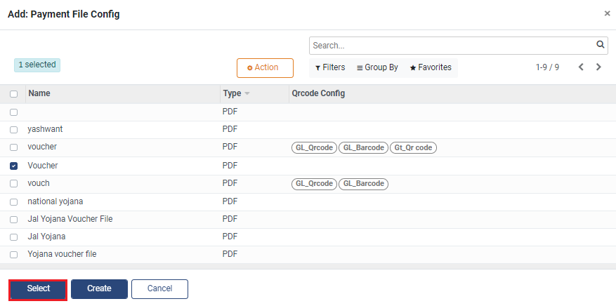
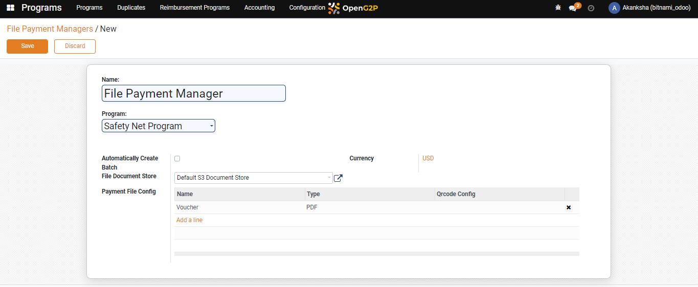
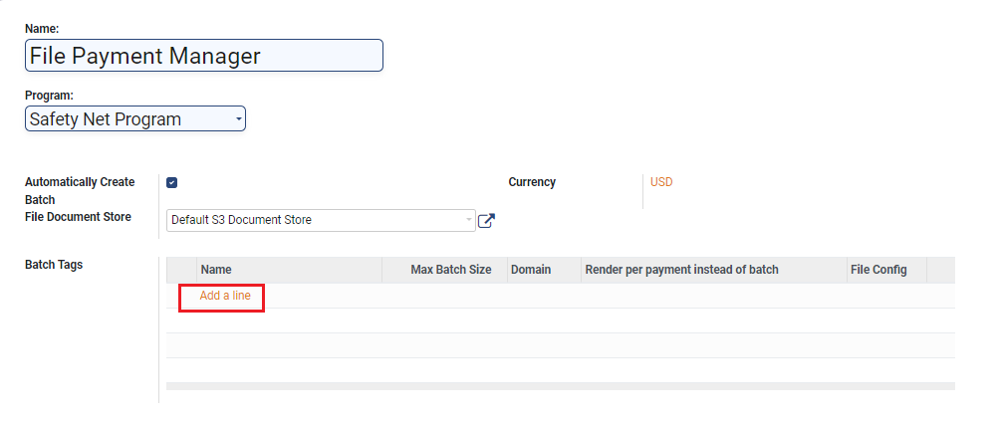
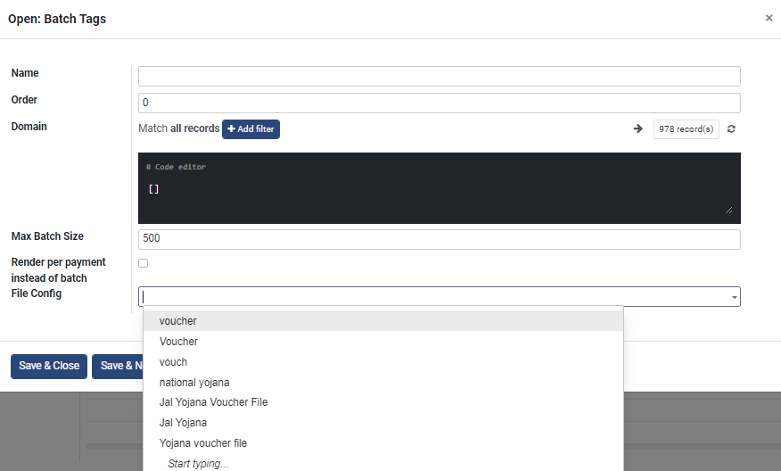
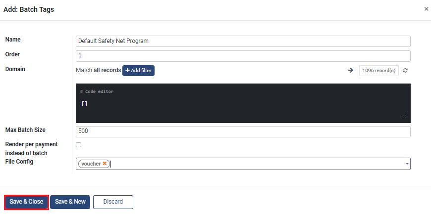
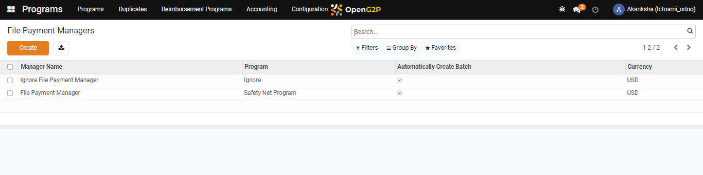

# Create File Payment Manager

## Description

This guide provides the steps to configure the file payment manager.

## Pre-requisites

The user should have a Program Administrator role.

## Steps

1. Navigate to _Programs_ using the menu bar.

<figure><figcaption></figcaption></figure>

2. Click on _Configuration_.

<figure><figcaption></figcaption></figure>

3. Select _File Payment Managers_ from the drop-down list.

<figure><figcaption></figcaption></figure>

4. Click on _Create_.

<figure><figcaption></figcaption></figure>

5. Enter the details

* _Name:_ Enter the name of the manager.
* _Program:_ Select the program from the drop-down list
* _Automatically Created Batch:_ Check the box if the user wants to create automatic batches.
* Currency: Enter the currency.
* _File Document Store:_ Select the file from the drop-down list.

<figure><figcaption></figcaption></figure>

Note: To avoid creating an automatic batch, follow these steps. Alternatively, if you wish to create an automatic batch, go to step#9.&#x20;

6. Click on _Add a Line_ under the _Payment File Configuration._

<figure><figcaption></figcaption></figure>

7. Select the file and click on _Select_.

<figure><figcaption></figcaption></figure>

8. Click on _Save_.

<figure><figcaption></figcaption></figure>

9. If the box _Automatically Create Batch_ was enabled, the _Batch Tags_ field appears. Click on _Add a Line_.

<figure><figcaption></figcaption></figure>

10. A dialogue box appears. Click on _Create_.

<figure><figcaption></figcaption></figure>

11. A new pop-up window appears. Enter the details and select the configured file from the file drop-down list in the _File Config_ field.

<figure><figcaption></figcaption></figure>

12. Click on _Save and Close_.

<figure><figcaption></figcaption></figure>

13. Click on _Save_.

<figure><figcaption></figcaption></figure>

13. A new file payment manager is created and will be added to the list.

<figure><figcaption></figcaption></figure>
