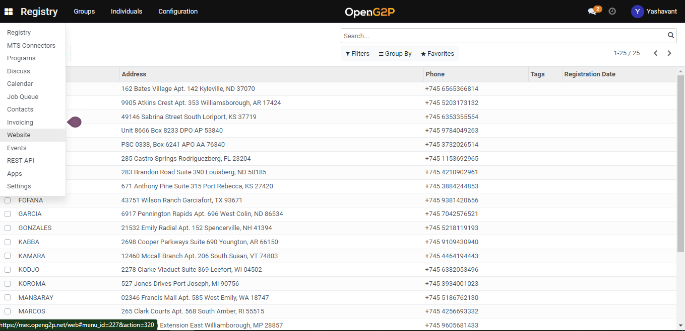
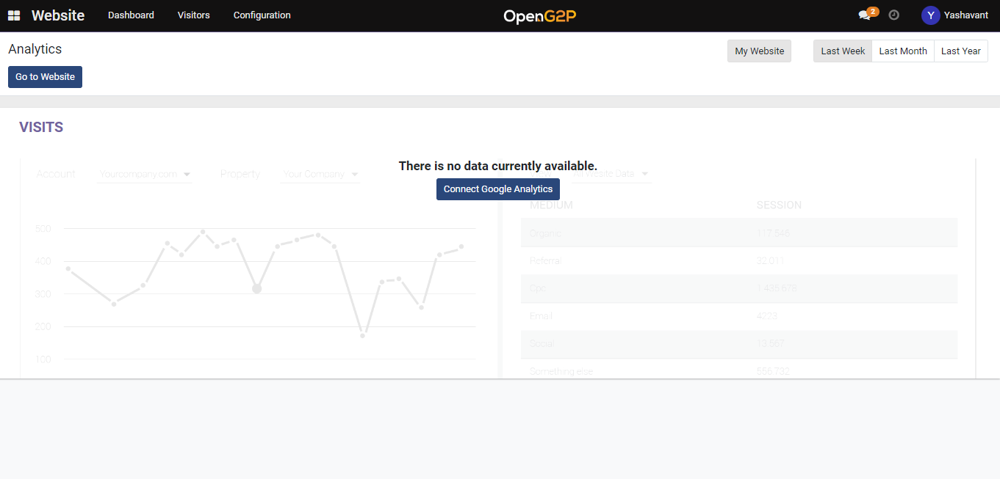
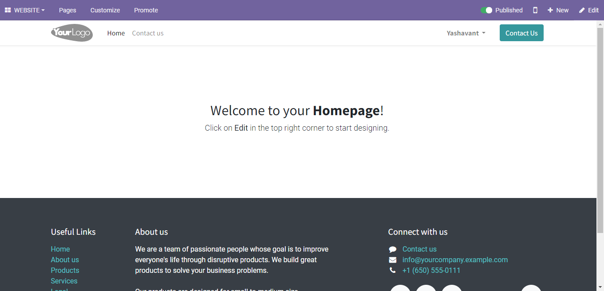

# Create Portal Form

## Description

This guide provides steps to create a new portal form for a program. This form will show up on the Self-Service Portal when the user selects a program to apply.

## Pre-requisites

The user must have a Program Manager role. See [Create User and Assign Role](assign-roles-to-users.md) guide.

## Steps

1. &#x20;Navigate to the _Website_ using the menu bar.

<figure><figcaption></figcaption></figure>

2. Click on _Go to Website_ to navigate to the website home page.

<figure><figcaption></figcaption></figure>

3. Click on the + _New_ button to create new form.

<figure><figcaption></figcaption></figure>

4. Click on _Page_ to create a form.

<figure><figcaption></figcaption></figure>

5. Enter the page title and click on _Create_ button under New Page pop-up window.

<figure><figcaption></figcaption></figure>

6. Drag and drop the _Form_ in the _Dynamic Content_ from the _BLOCKS_ section.

<figure><figcaption></figcaption></figure>

7. Edit the form fields from the _STYLE_ section.&#x20;

<figure><figcaption></figcaption></figure>

8. Add more form fields using _+Field_ from the _STYLE_ section.
9. Save the form using the _Save_ button.
