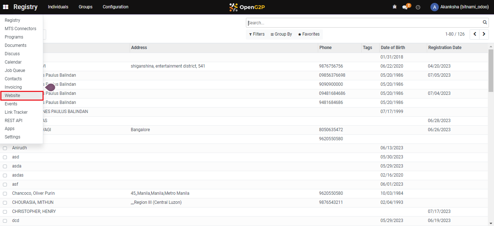
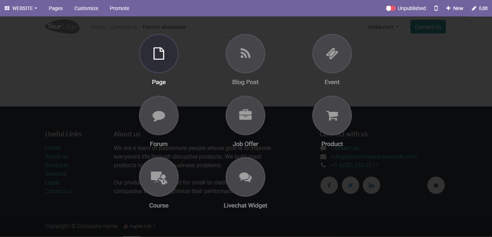
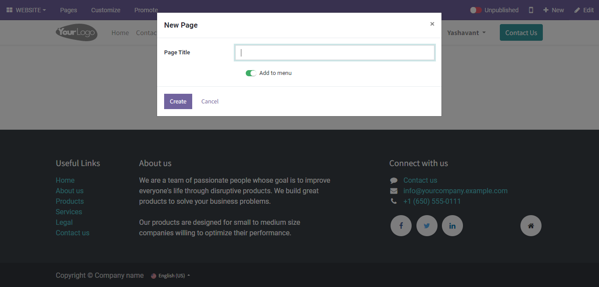
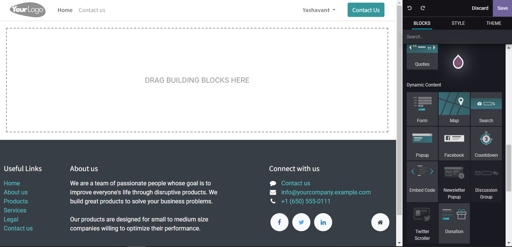
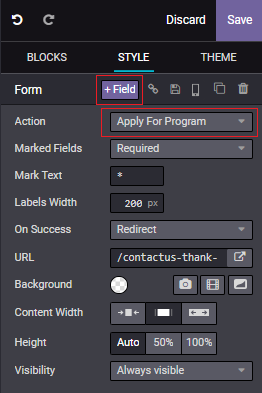
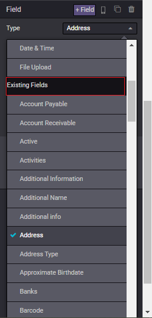
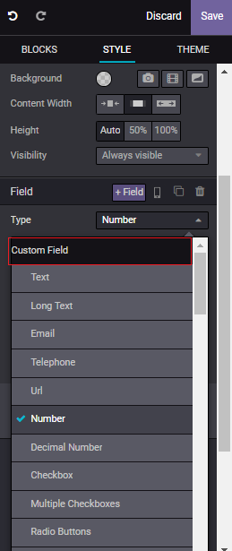
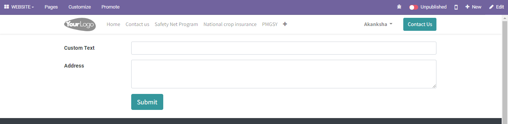
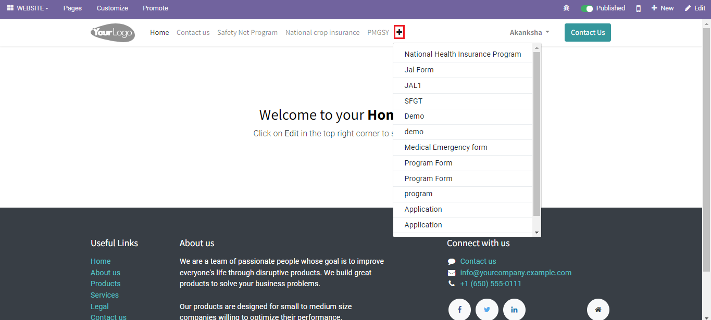

# Create Self-Service Portal Form

## Description

This guide provides steps for the Website Editor to create a general intake sheet. This intake sheet is filled by the applicant while applying for a program.

## Pre-requisites

The user must have a Website Editor role.

## Steps

1. Navigate to the _Website_ using the menu bar.

<figure><figcaption></figcaption></figure>

2. Click on _Go to Website_ to navigate to the website home page.

<figure><figcaption></figcaption></figure>

3. Click on the + _New_ button to create a new form.

<figure><figcaption></figcaption></figure>

4. Click on _Page_ to create a form.

<figure><figcaption></figcaption></figure>

5. Enter the page title and click on _Create_ button under New Page pop-up window.

<figure><figcaption></figcaption></figure>

6. Drag and drop the _Form_ in the _Dynamic Content_ from the _BLOCKS_ section
7. The _Edit_ tool appears. Click on the _Form's Fields_ to enable the _Style Section_.

<figure><figcaption></figcaption></figure>

8. &#x20;Select _Apply For Program_ and add more form fields using _+Field_ from the _STYLE_ section.

<figure><figcaption></figcaption></figure>

9. In the _Field_ section, select the type _Existing Fields_ and select the fields of choice.

<figure><figcaption></figcaption></figure>

10. To add fields that are not available under Existing Fields, use the type _Custom Field_ and add desired fields.

<figure><figcaption></figcaption></figure>

11. Click _Save_ to add the field to the portal form.

<figure><figcaption></figcaption></figure>

12. You can also create a form from an existing one on the portal by clicking the + sign on the menu and selecting the desired one.

<figure><figcaption></figcaption></figure>

