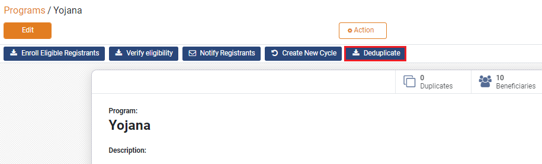

# Deduplicate Registrants

## Description

This guide provides the steps to identify duplicate registrants in the program. The registrants are deduplicated based on the Deduplication Managers configured in the program.

## Pre-requisites 

The user should have a Program Administrator role.

## Steps 

1. Navigate to _Programs_ using the menu bar.

<figure><figcaption></figcaption></figure>

2. Click on the desired program name.

<figure><figcaption></figcaption></figure>

3. The _Programs_ detail page shows the number of beneficiaries enrolled in the program.

<figure><figcaption></figcaption></figure>

4. Check on the _Beneficiaries_ to view the complete list of registrants including the registrants in _Draft_ status.

<figure><figcaption></figcaption></figure>

4. Navigate back to the program detail view page and click on _Deduplicate._

<figure><figcaption></figcaption></figure>

5. The registrants with duplicate IDs are marked _Duplicated_ in the status column.

<figure><figcaption></figcaption></figure>
