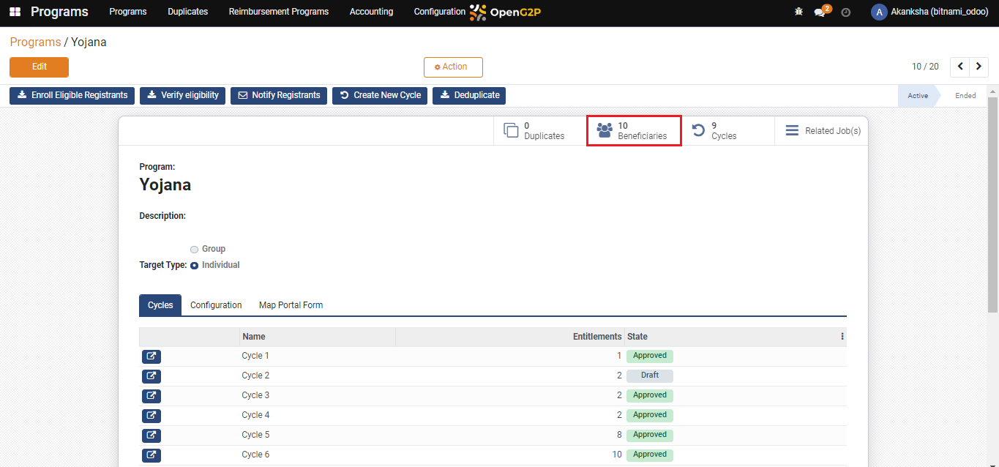
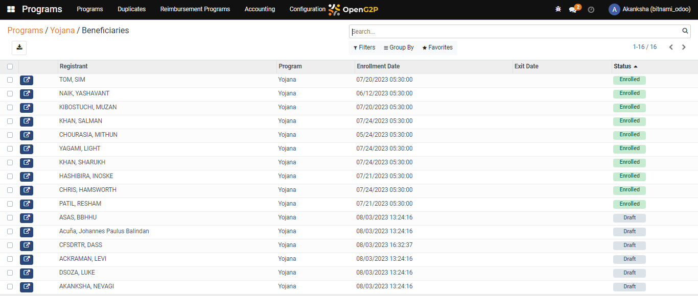
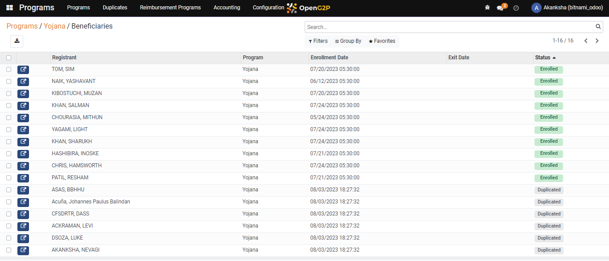

# Deduplicate Registrants

## Description

This guide will help the user to identify the duplicate registrants in the program. And also help to deduplicate the registrants of the program who are enrolled with duplicate IDs.&#x20;

## Pre-requisites 

The user should have a Program Administrator role.

## Steps 

1. Navigate to _Programs_ using the menu bar.

<figure><figcaption></figcaption></figure>

2. Click on the desired program name.

<figure><figcaption></figcaption></figure>

3. Once you have arrived on the Program Details page, check the _Beneficiaries_ section for the registrants who are in _Draft_ status.

<figure><figcaption></figcaption></figure>

 

<figure><figcaption></figcaption></figure>

4. Navigate back to the program detail view page and click on _Deduplicate._&#x20;

<figure><figcaption></figcaption></figure>

5. The applicant with duplicate IDs is marked with _Duplicate_ status.

<figure><figcaption></figcaption></figure>
