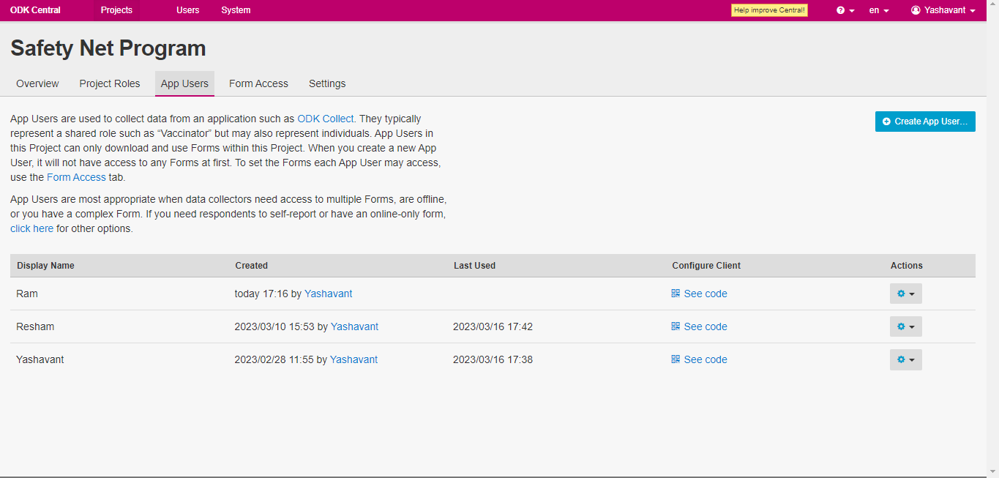

# Download Form on ODK Collect

## Description

This guide will help to download the program form on ODK Collect Application running on an Android tablet or phone.

## Pre-requisites

* The field agent should have ODK Collect Application installed.
* The field agent should have[ form access](https://app.gitbook.com/o/bnTr6Kp4z4CXR4QVIPSa/s/xkdlCOLME2p03rS8nG8u/\~/changes/174/guides/user-guides/provide-form-access-to-field-agent).

## Steps

1. The Administrator logs into ODK Central and navigates to the _App Users_ under the program name.

<figure><figcaption></figcaption></figure>

2. Click on _See Code_ to get the _Client Configuration QR_ _code_.

<figure><figcaption></figcaption></figure>

3. Open the ODK Collect application in the field agent device.

<figure><figcaption></figcaption></figure>

4. Click on _Add Project_ to scan the configuration QR code.

<figure><figcaption></figcaption></figure>

5. After scanning the _Client Configuration QR_ _code_ all the given access program forms will be downloaded to the field agent's device.

<figure><figcaption></figcaption></figure>

<figure><figcaption></figcaption></figure>

