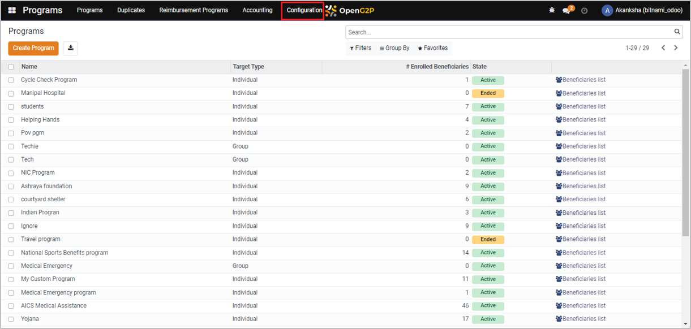
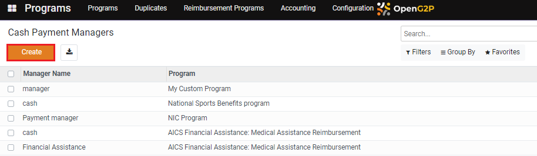
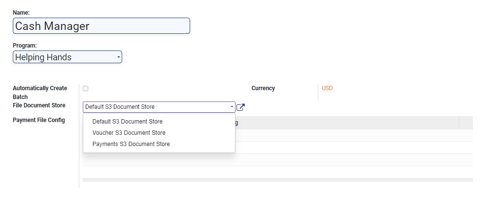
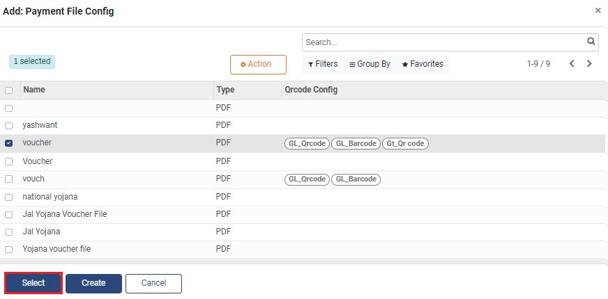

# Create Cash Payment Manager

## Description

This guide provides the steps to configure the Cash Payment Manager.

## Pre-requisites

The user should have a Program Administrator role.

## Steps

1. Navigate to _Programs_ using the menu bar.

<figure><figcaption></figcaption></figure>

2. Click on _Configuration_.

<figure><figcaption></figcaption></figure>

3. Select _Cash Payment Managers_ from the drop-down list.

<figure><figcaption></figcaption></figure>

4. Click on _Create_.

<figure><figcaption></figcaption></figure>

5. Enter the details.

* _Name:_ Name of the manager
* _Program:_ The program that will use this Payment Manager
* _Automatically Created Batch:_ If enabled, the system creates batches automatically
* Currency: Currency used for beneficiary payment
* _File Document Store:_ The type of storage used for the payment file
* _Payment File Config:_ The name of the payment file

The payment file is configured based on the state of the _Automatically Created Batch_ checkbox:

**Disabled:** Only one payment file is associated with this payment manager and configured using the _Payment File Config_ dropdown. Go to step#6.

**Enabled:** Each batch has one payment file configured as part of the _Batch Tags_ configuration. In this case, the _Batch Tags_ configuration replaces the _Payment File Config_ dropdown. Go to step#9.

<figure><figcaption></figcaption></figure>

6. Click on _Add a Line_ under the _Payment File Config_.

<figure><figcaption></figcaption></figure>

7. Select the file and click on _Select_.

<figure><figcaption></figcaption></figure>

8. Click on _Save_ and go to step#14.

<figure><figcaption></figcaption></figure>

9. Click on _Add a Line_ in _Batch Tags_ configuration.

<figure><figcaption></figcaption></figure>

10. A dialogue box appears. Click on _Create._

<figure><figcaption></figcaption></figure>

11. A new pop-up window appears. Enter the details.

* _Name_: The name of batch tags
* _Order_: The order number of this batch during sequential execution of the batches
* _Domain:_ Filter to add the criteria for this batch
* _Max Batch Size_: Maximum number of payment entries in the batch
* _Render per payment instead of batch_: If enabled, the payments are rendered individually instead of in a batch
* _File Config:_ Name of the payment file for this batch

<figure><figcaption></figcaption></figure>

12. Click on _Save & Close._

<figure><figcaption></figcaption></figure>

13. Click on _Save._

<figure><figcaption></figcaption></figure>

14. A new Cash Payment Manager is created and added to the list.

<figure><figcaption></figcaption></figure>
