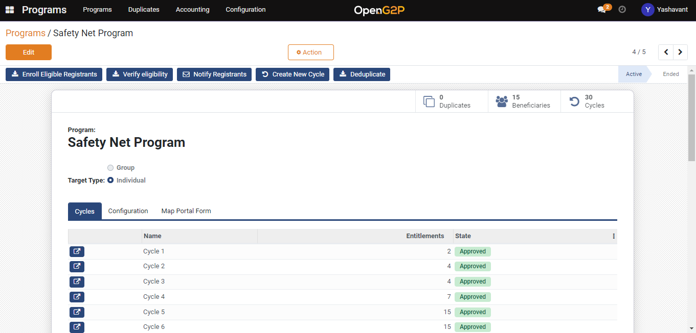
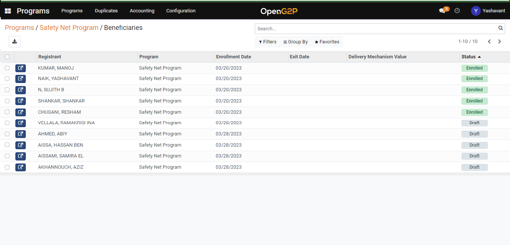

# Enrol Registrants into Program

## Description

This guide will help enrol registrants into a program, who are registered through offline registration and online self-registration process.

## Pre-requisites

* The user must have a Program Manager role. See [Create User and Assign Role](assign-roles-to-users.md) guide.
* There should be registrants with respect to the program

## Steps

1. &#x20;Navigate to _Programs_ using the menu bar.

<figure><figcaption></figcaption></figure>

2. Click on the program name on which enrolment needs to be done.

<figure><figcaption></figcaption></figure>

3. After landing on Program detailed view page, check the _beneficiaries_ section for the registrants who are in draft status.

<figure><figcaption></figcaption></figure>

<figure><figcaption></figcaption></figure>

4. Navigate back to the program list view page and click on _Enrol Eligible Registrants_ to enrol the registrants who are in draft status.
5. Enrolment of registrants will be based on the Eligibility criteria set as per the program.
6. The registrants who pass the eligibility criteria will be enrolled on the program with _Enrolled_ status and those who fail the eligibility criteria will be given _Not Eligible_ status.

<figure><figcaption></figcaption></figure>
