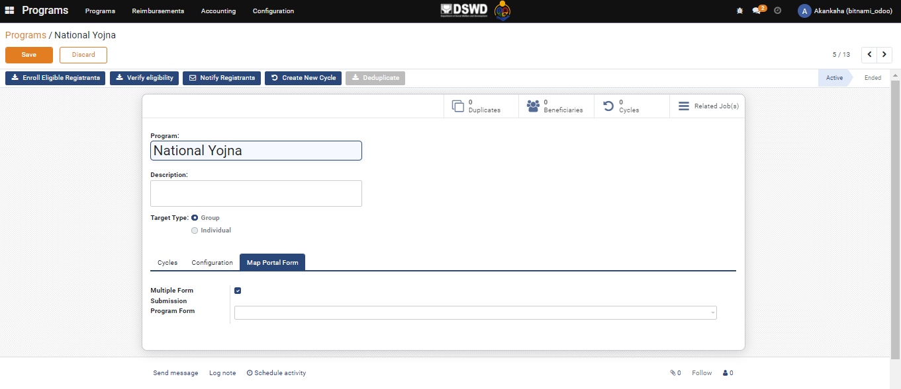
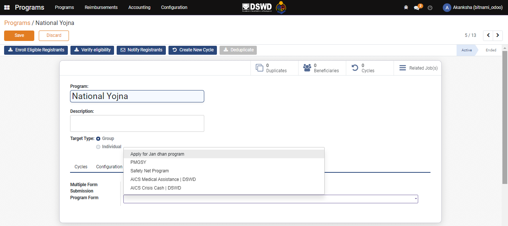

# Map Self-Service Portal Form

## Description

This guide provides steps to map the portal form for the new and existing programs.&#x20;

## Pre-requisites

The user must have a Program Manager role. The program is already created using the steps from the [create-a-program.md](create-a-program.md "mention") guide.&#x20;

## Steps

1.

<figure><figcaption></figcaption></figure>

2.

<figure><figcaption></figcaption></figure>

3. A dialogue box appears, navigate to the _Map Portal Form._

<figure><figcaption></figcaption></figure>

4.

<figure><figcaption></figcaption></figure>

#### For Existing Program

1. Click on _Home_ Menu and navigate to Programs.

<figure><figcaption></figcaption></figure>

2. Click on the P_rogram_ Name for which mapping is to be done.

<figure><figcaption></figcaption></figure>

3. Navigate to the _Map Portal Form._

<figure><figcaption></figcaption></figure>

4. Check the _Box_ if the user wants multiple submissions. And Select the _Portal Form_ that needs to be mapped from the drop-down list.
5. And Click on _Save_.

<figure><figcaption></figcaption></figure>

6. The Application gets mapped under the Program.

<figure><figcaption></figcaption></figure>
