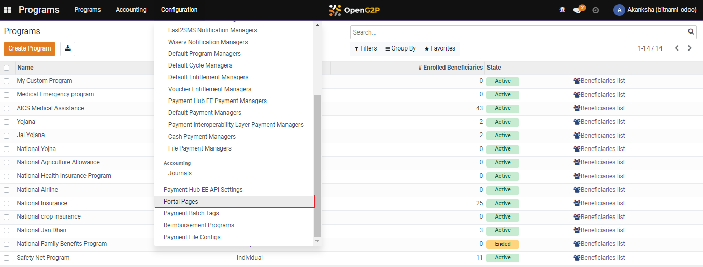
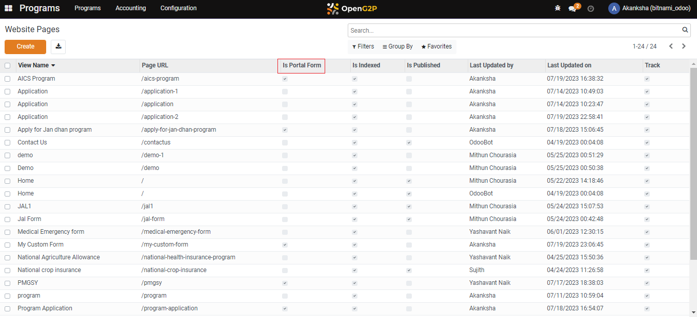
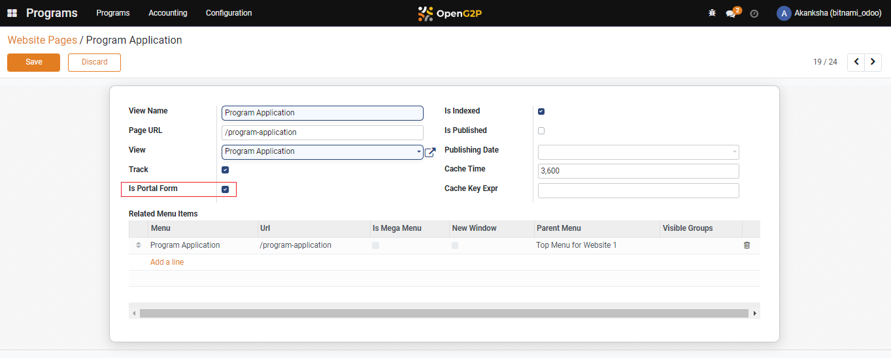
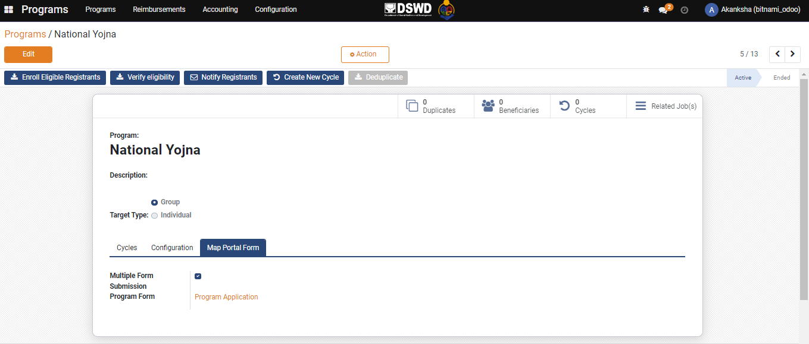

# Map Self-Service Portal Form

## Description

This guide provides steps to map the portal form for existing programs. And the form will show up when the beneficiary wants to enroll in a certain program.

## Pre-requisites

The user must have a Program Manager role.

The program is already created using the steps from the [Create Program](create-a-program.md) guide.&#x20;

## Steps

1. Navigate to _Programs_ using the menu bar.

<figure><figcaption></figcaption></figure>

2. Click on _Configuration_.

<figure><figcaption></figcaption></figure>

3. Navigate to _Portal Pages_.

<figure><figcaption></figcaption></figure>

4. Click the form that needs to be marked as _Is Portal Form._&#x20;

<figure><figcaption></figcaption></figure>

5. Select _Is Portal Form_ and Click on _Save_.

<figure><figcaption></figcaption></figure>

6. The Portal Form gets added to the drop-down list.

<figure><figcaption></figcaption></figure>

7. Click on _Home_ Menu and navigate to _Programs_.

<figure><figcaption></figcaption></figure>

8. Click on the _Program_ Name for which mapping is to be done.

<figure><figcaption></figcaption></figure>

9. Navigate to the _Map Portal Form._

<figure><figcaption></figcaption></figure>

10. Check the _Box_ if the user wants multiple submissions. And Select the _Portal Form_ that needs to be mapped from the drop-down list.
11. And Click on _Save_.

<figure><figcaption></figcaption></figure>

12. The Application gets mapped under the Program.

<figure><figcaption></figcaption></figure>
