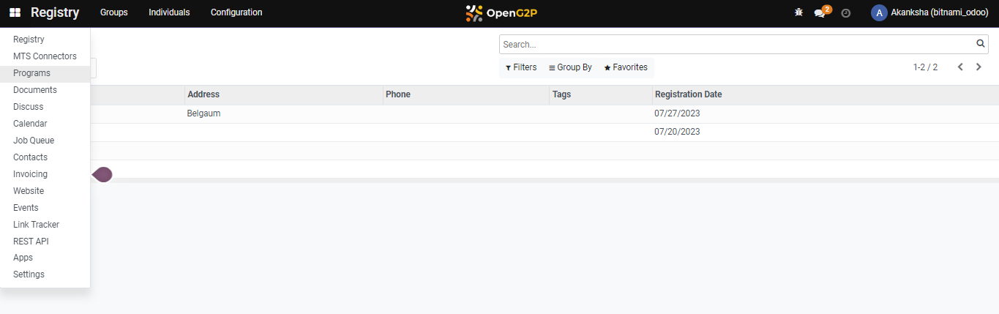
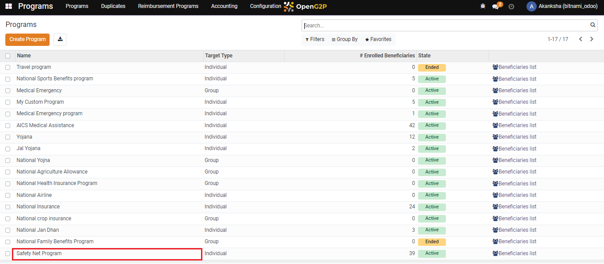
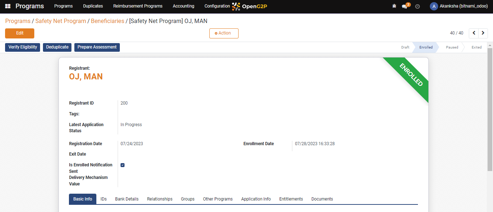
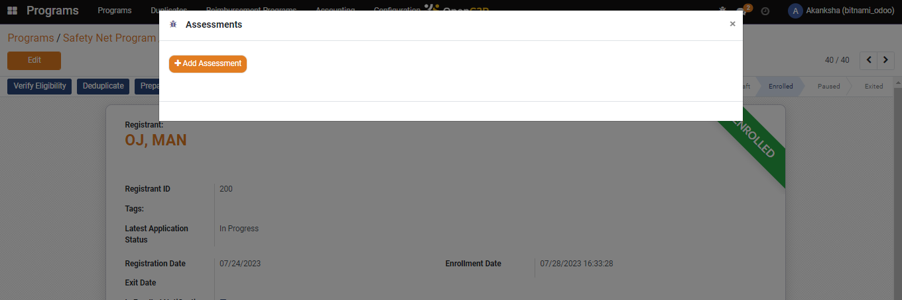
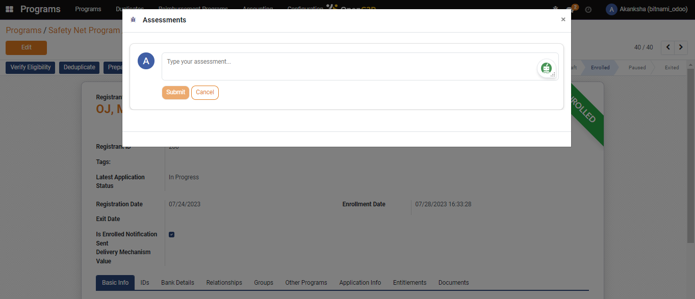
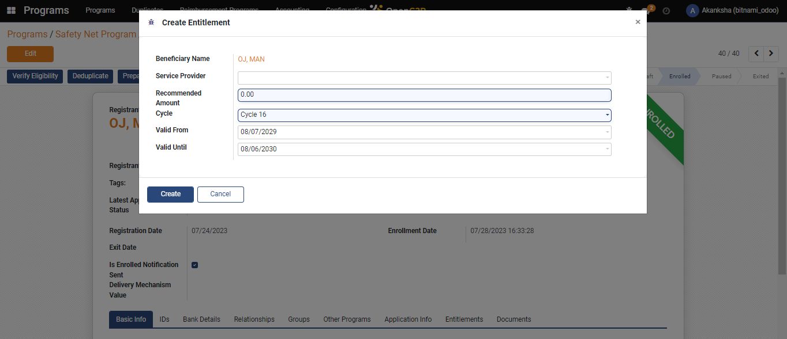
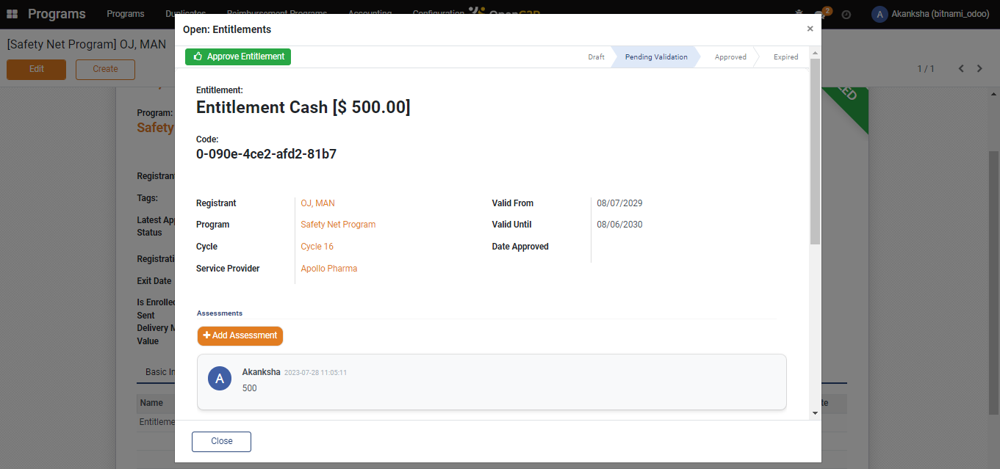
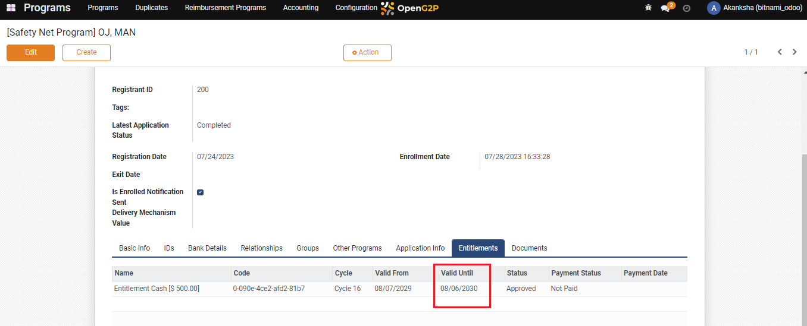

# Multi-Stage Approval

## Description

This guide provides steps for multiple stages of approving a beneficiary's entitlement. Each stage is assigned one entitlement manager to carry out the necessary approvals.  The steps in this guide have to be carried out by each entitlement manager in the order of the stages.&#x20;

## Pre-requisites

The user is a Program Administrator and has configured multiple stages of entitlement and assigned an entitlement manager for each stage. Learn more about creating multiple stages of entitlement [here](multi-stage-configuration.md).

## Steps

1. Navigate to _Programs_ using the menu bar.

<figure><figcaption></figcaption></figure>

2. Click on the desired program.

<figure><figcaption></figcaption></figure>

3. Click on the _Beneficiaries_. Clicking will show the list of applicants.

<figure><figcaption></figcaption></figure>

 

<figure><figcaption></figcaption></figure>

Note: Only the entitlement manager for the first stage can verify eligibility, enrol, and deduplicate the applicants. (Go to step#6 if you are the entitlement manager for the first stage).

4. Click on _Verify Eligibility_, _Enroll,_ and _Deduplication_. Once the applicant is enrolled the beneficiary status changes to _Enrolled_.

<figure><figcaption></figcaption></figure>

 

<figure><figcaption></figcaption></figure>

5. Click on _Prepare Assessment._

<figure><figcaption></figcaption></figure>

6. A pop-up window appears. Click on _+ Add Assessment._

<figure><figcaption></figcaption></figure>

7. You can write an assessment in the new pop-up and click _Save_.

<figure><figcaption></figcaption></figure>

8. After creating an assessment, the _Create Entitlement_ and _Reject_ buttons appear. You can make a decision based on the authenticity of the application.

* Authentic Application: Create an entitlement by clicking on _Create Entitlement_ button_._
* Inauthentic Application: Reject the application by clicking on the _Reject_ button.

<figure><figcaption></figcaption></figure>

9. Click on _Create Entitlement_ to view the _Create Entitlement_ page and fill in the required details as described here.

* _Service Provider:_ Select the service provider from the drop-down list.
* _Recommended Amount:_ Enter the recommended amount as assessed.
* _Cycle:_ The latest cycle is selected by default. You can also select the cycle from the drop-down list.
* _Valid From:_ Select the date when you want to begin the entitlement.
* _Valid Until:_ Select the date when you want to end the entitlement.

<figure><figcaption></figcaption></figure>

10. Click on _Create_. The entitlement will be created for the beneficiary.

Note: Only the entitlement manager for the first stage can approve. (the status of entitlement will be changed from draft to pending validation).

11. Click on _Entitlement_, and the entitlement will be in _Draft_ status

<figure><figcaption></figcaption></figure>

12. Click the _Entitlement_, and a pop-up window appears with an _Approve_ _Entitlement_ button.

<figure><figcaption></figcaption></figure>

13. Click on _Approve_ _Entitlement_, and the status will be changed to _Pending Validation._

Note: Now, the entitlement manager with the second stage of approval approves the entitlement. (The status of entitlement will be changed from pending validation to approved only when the user is a final approver; otherwise,  the status will be pending validation until the final approver approves the entitlement.)

14. Click on _Entitlement_, and the entitlement will be in _Pending Validation_ status.

<figure><figcaption></figcaption></figure>

15. Click the _Entitlement_, and a pop-up window appears with an _Approve Entitlement_ button.

<figure><figcaption></figcaption></figure>

16. Click on _Approve Entitlement_, and the status will be changed to _Approve_.

<figure><figcaption></figcaption></figure>

**Note**: After final approval as per the payment configuration, the action buttons will be populated (if the voucher is set as part of the entitlement manager, the generate a voucher button will be populated).
