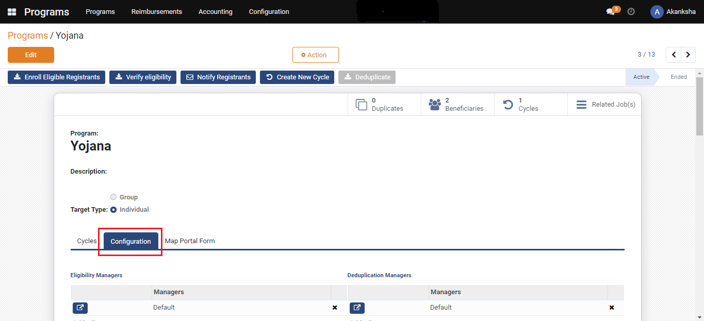
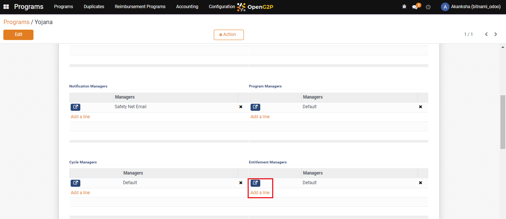
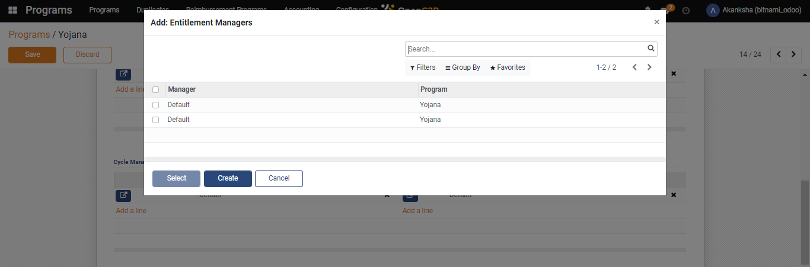
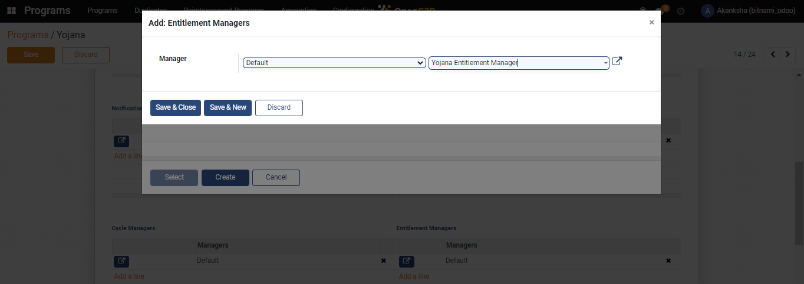
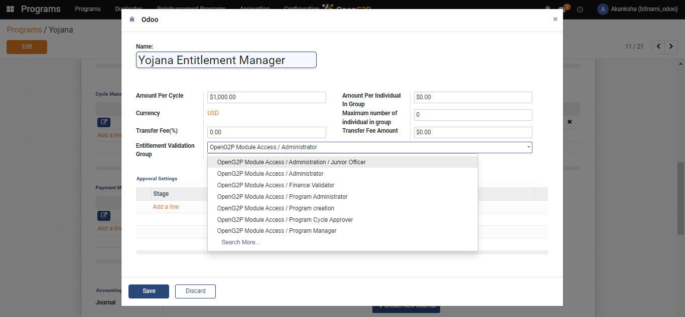
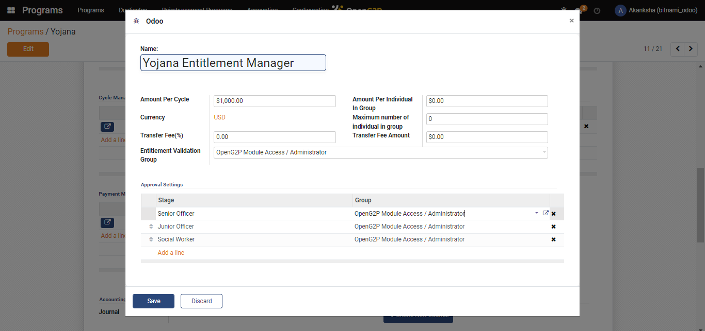
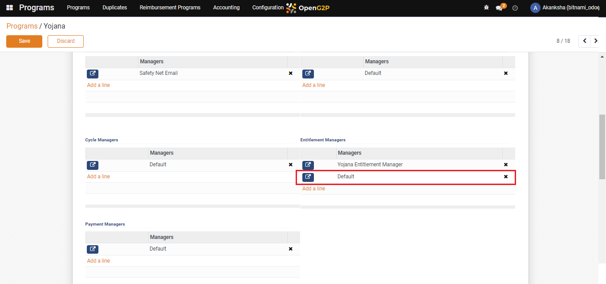

# Multi-Stage Configuration

## Description

This guide provides steps to add multiple entitlement managers for the program. Each manager is responsible for assessing the entitlement for one of the stages. Entitlement managers get access rights from the group they belong to.

## Pre-requisites

The user has a Program Administrator role and has created an entitlement manager group. Learn more about creating the entitlement manager group [here](create-entitlement-manager-role.md).

## Steps

1. Navigate to _Programs_ using the menu bar.

<figure><figcaption></figcaption></figure>

2. Click on the program name for which configuration is to be done.

<figure><figcaption></figcaption></figure>

3. Navigate to the _Configuration_ section on the program's detailed view page.

<figure><figcaption></figcaption></figure>

4. Click on _Add a Line_ in the _Entitlement Managers_ section.

<figure><figcaption></figcaption></figure>

5. A pop-up window appears. Click on _Create_.

<figure><figcaption></figcaption></figure>

6. Another Pop-up window appears. Select _Default_ from the drop-down.
7. Enter the manager's name, and click on _Create and Edit_.

<figure><figcaption></figcaption></figure>

8. Select the relevant group from the _Entitlement Validation Group_ drop-down list.

<figure><figcaption></figcaption></figure>

9. Click on _Add a line_ in the _Approval Settings_ section.

<figure><figcaption></figcaption></figure>

10. In the _Approval Settings,_ add the approval. And click on _Save_.

<figure><figcaption></figcaption></figure>

11. The entitlement manager gets added to the list of entitlement managers for the program.
12. Repeat steps from step#4 to step#11 to add one entitlement manager for each stage.
13. Delete the default entitlement manager and click on _Save_.

<figure><figcaption></figcaption></figure>
