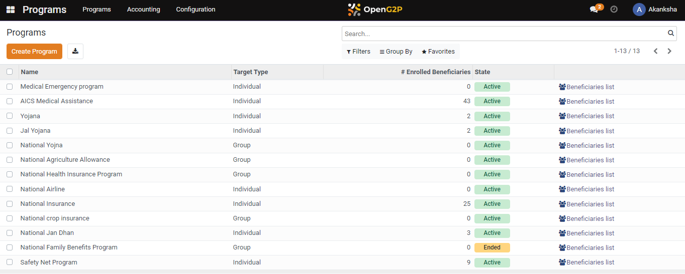

# Multi-Stage Configuration

## Description

This guide provides steps to add multiple entitlement managers for the program. Each manager is responsible for assessing the entitlement for one of the stages.

## Pre-requisites

The user must have the Program Administrator role.

## Steps

1. Navigate to _Programs_ using the menu bar.

<figure><figcaption></figcaption></figure>

2. Click on the P_rogram_ Name for which configuration is to be done.

<figure><figcaption></figcaption></figure>

3. Navigate to the _Configuration_ section on the program detailed view page.

<figure><figcaption></figcaption></figure>

4. Click on the _icon_ in the Entitlement Managers section.

<figure><figcaption></figcaption></figure>

5. A pop-up window appears, navigate to the approval settings and click on _Add a Line._

<figure><figcaption></figcaption></figure>

6. Under the group select the role from the drop-down list, and click on the _Save_ button.

<figure><figcaption></figcaption></figure>

7. The manager gets added to the entitlement field in the program.

<figure><figcaption></figcaption></figure>
