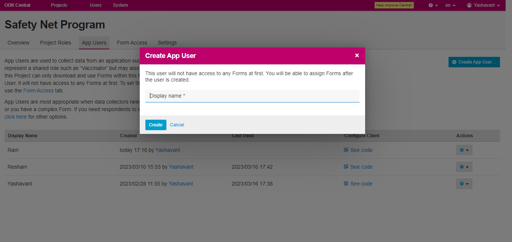
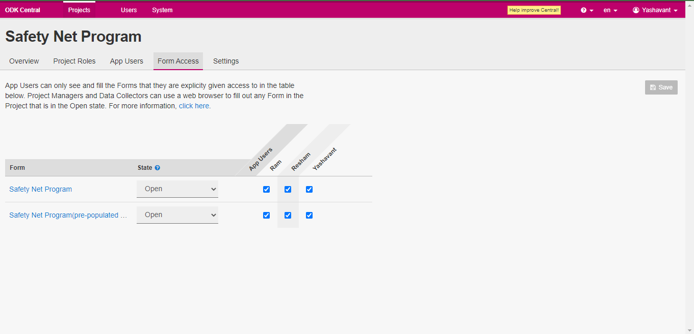

# Provide Form Access to Field Agent

## Description

This guide will help to provide the form access to the field agent. which helps the agent to download the program form.

## Pre-requisites

* Access Providers should have the Administrator role in ODK Central.

## Steps

1. Login to ODK central with a user having an Administrator role.
2. Click on the program name in _Projects_ on which the agent access is to be provided.

<figure><figcaption></figcaption></figure>

3. Navigate to App Users below the program name.

<figure><figcaption></figcaption></figure>

4. Click on the +_Create App User_ button to add a field agent to the program.
5. Provide the name of the field agent on the popup window and click on _Create_ button, Agent name will be listed under the App user list.

<figure><figcaption></figcaption></figure>

6. Navigate to _Form Access_, select forms to give access to the field agent and click on the _Save_ button.

<figure><figcaption></figcaption></figure>
