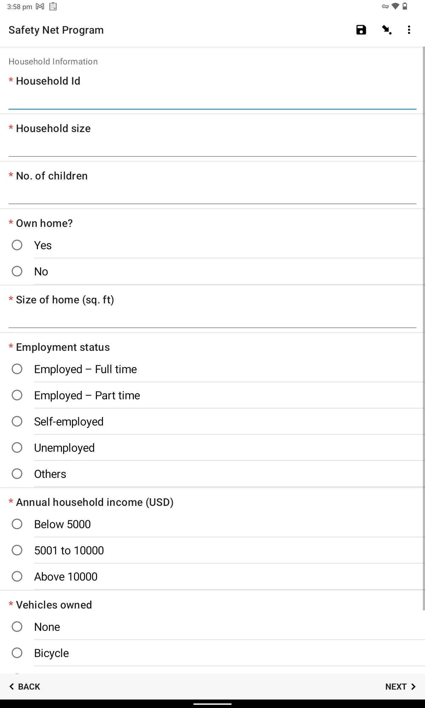
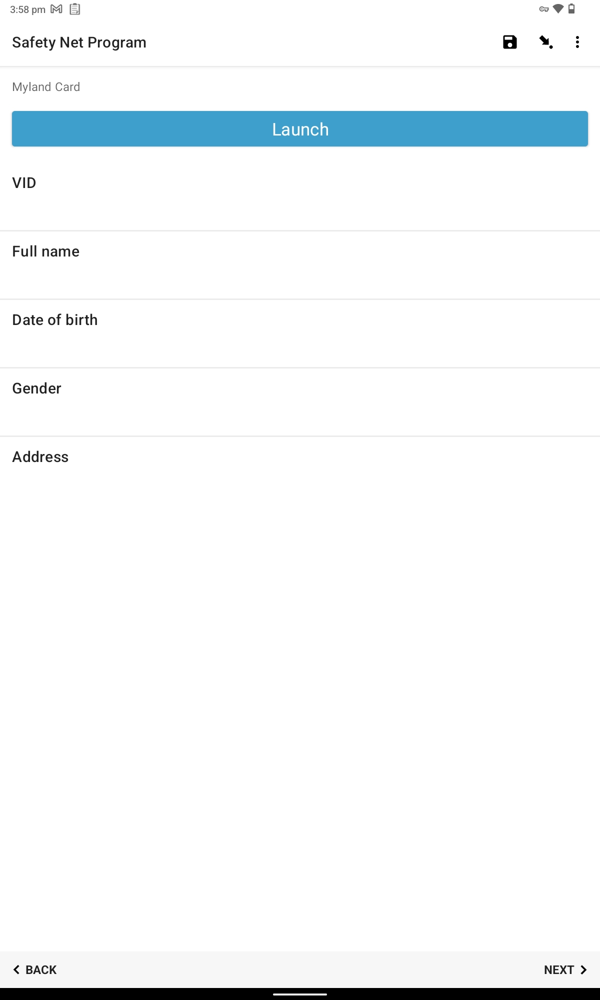
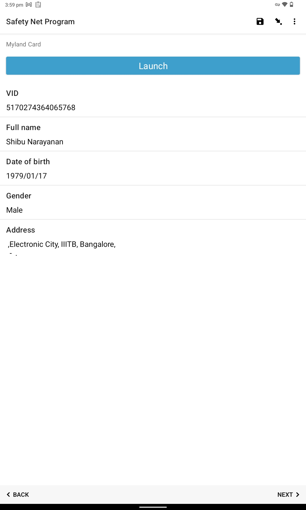
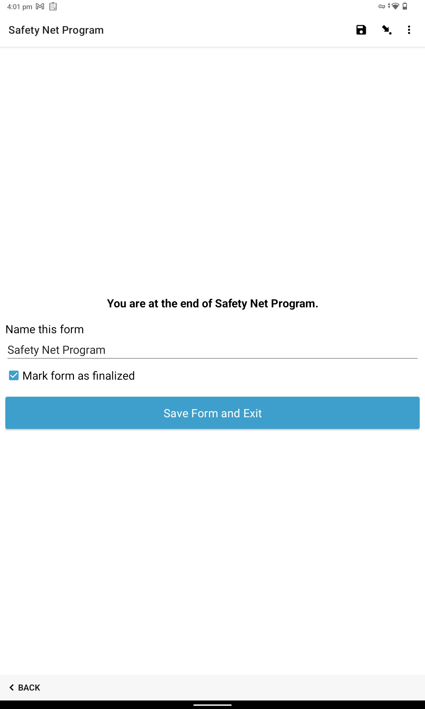

# Register Offline

## Description

This guide will provide the steps to register beneficiaries through an offline process.  [offline registration](../../secure-registry/offline-registration.md) is done by the Field Agent.

## Pre-requisites

* The agent should have ODK collect and Smart Scanner Application Installed
* Agents should have form access.
* Agents should have downloaded the program form on his/her device.
* Beneficiaries should have their National ID card with them.
* ODK MTS Connector which is mapped to the form should be in Running status.

## Steps

1. Open the program form from the ODK Collect application.

<figure><figcaption></figcaption></figure>

2. Click on _Fill Blank Form_ to fill in all form fields with beneficiary data.

<figure><figcaption></figcaption></figure>

3. At some point, the form will have the _Launch_ button. Click on the _Launch_ button to scan the QR code on the National ID of the Beneficiary.

<figure><figcaption></figcaption></figure>

4. Once the scanning is done beneficiary data will be auto-populated as per the form fields configuration.

<figure><figcaption></figcaption></figure>

5. After filling in all the mandatory fields click on the _Save and Submit_ button.

* If the Field Agent is online, the submitted entries will be sent to ODK Central and will be listed under _View Sent Form_ or else they will be saved in the Field Agents device in _Send Finalized Form Section._

<figure><figcaption></figcaption></figure>

