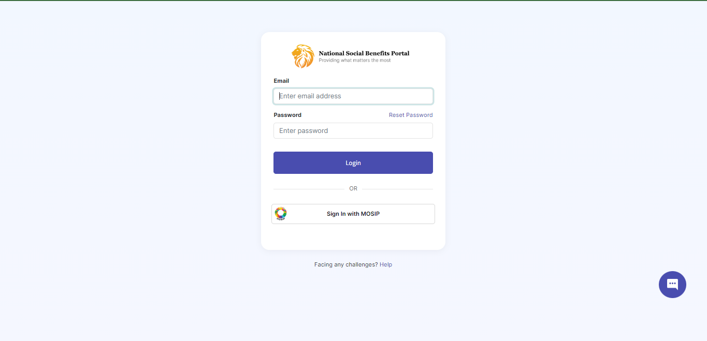
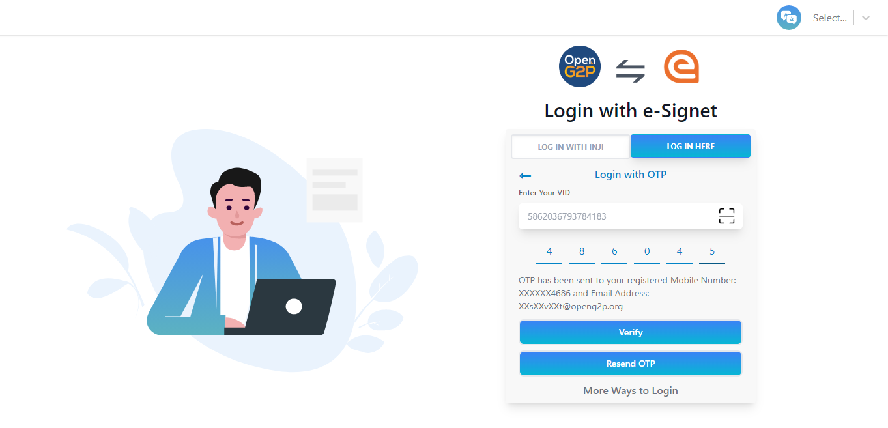
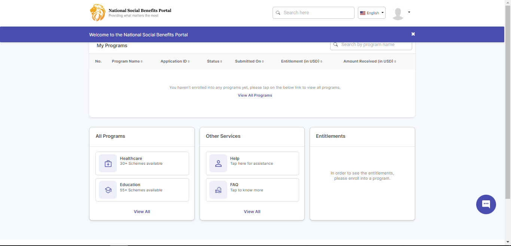
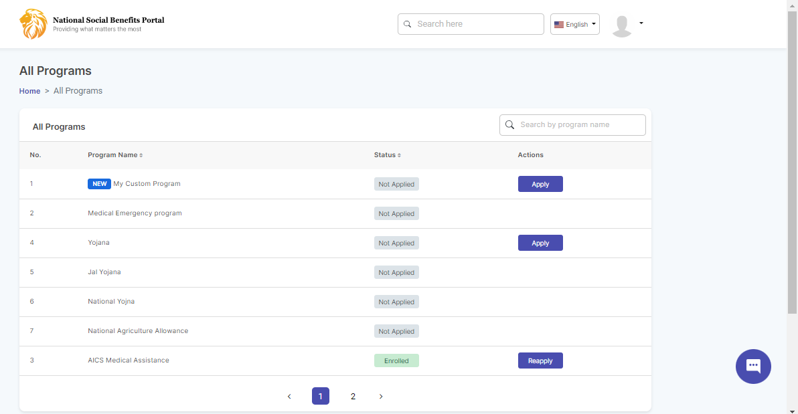
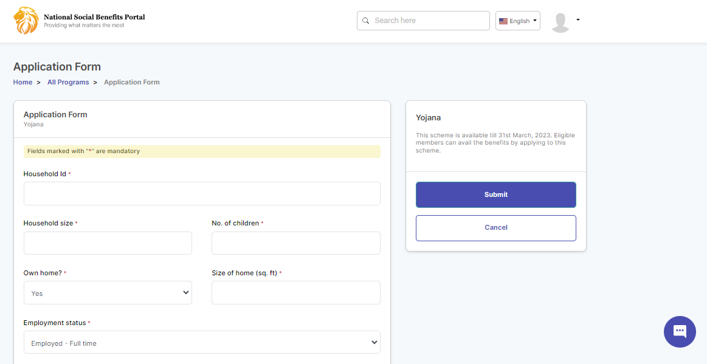
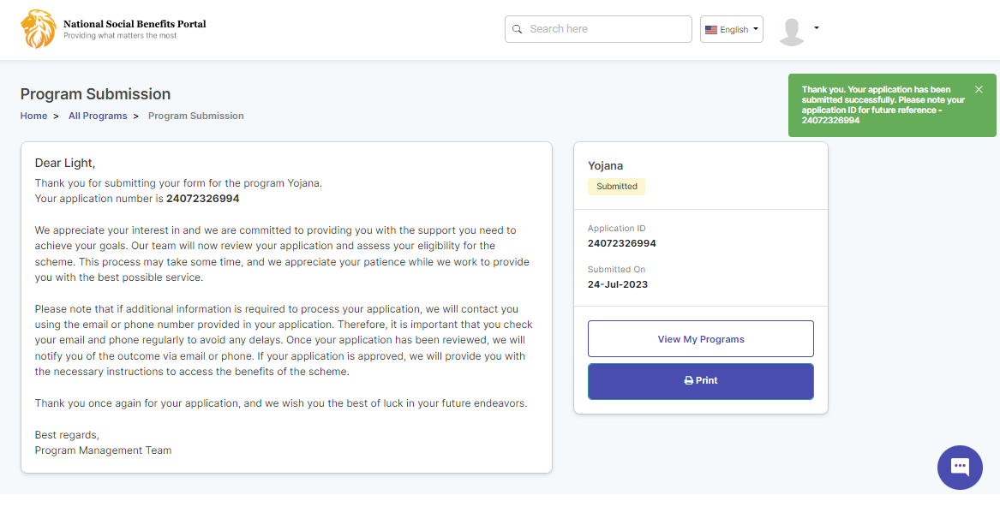
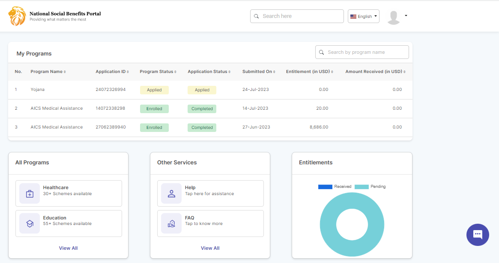
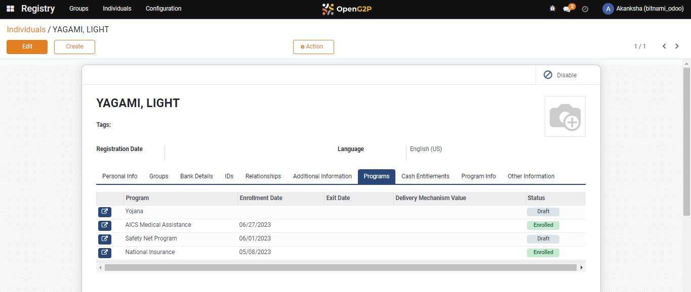

# Self Register Online

## Description

This guide helps beneficiaries to self-register through the beneficiary portal.

## Pre-requisites

Beneficiaries should have the MOSIP-issued national ID with them.

## Steps

1. Go to the beneficiaries portal login page.

<figure><figcaption></figcaption></figure>

2. Click on _Sign IN with MOSIP_ to continue with a MOSIP-issued national ID.
3. Navigate to _Login with OTP_ using _LOG IN HERE_ and provide the VID/UIN.

<figure><figcaption></figcaption></figure>

4. After clicking _Get OTP,_ OTP will be sent to the registered email and phone number.
5. Provide the OTP and click on _Verify_ to proceed further.

<figure><figcaption></figcaption></figure>

6. Provide consent and click on _Allow_ which navigates to the beneficiary portal home page.

<figure><figcaption></figcaption></figure>

7. Click on _View All Programs_ to check out the available programs to apply for.

<figure><figcaption></figcaption></figure>

8. Click on _Apply_ to fill in the beneficiary details in the program form.

<figure><figcaption></figcaption></figure>

9. Once the form fields are filled click on _Submit_ button for application submission.

<figure><figcaption></figcaption></figure>

<figure><figcaption></figcaption></figure>

10. Once the program form is submitted, the program will be added to the _My Programs_ section with the _Submitted_ status and the beneficiary will be registered to the program. also will be listed in the _OpenG2P Registry Individual_ as well.

<figure><figcaption></figcaption></figure>

<figure><figcaption></figcaption></figure>
