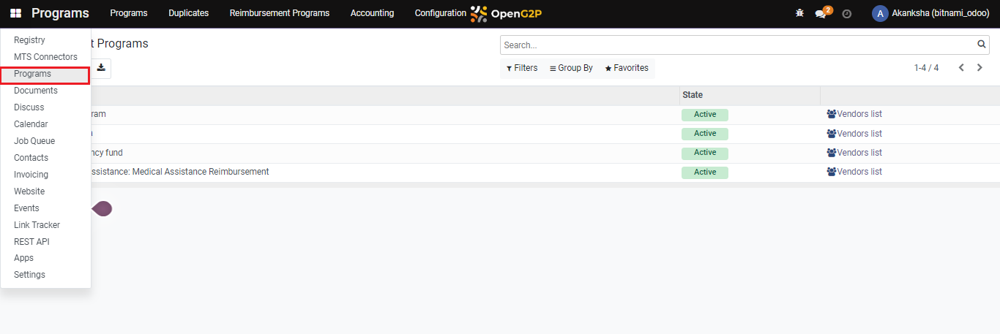
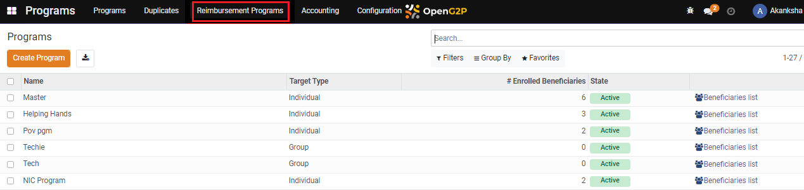
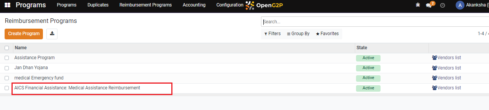
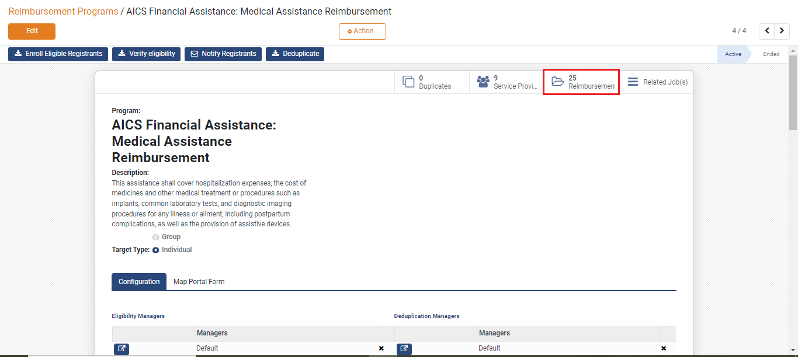
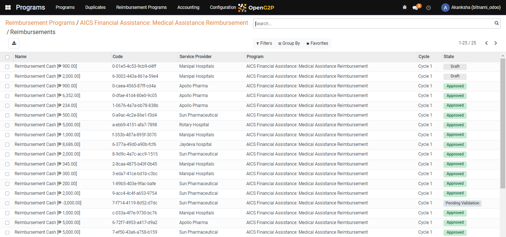
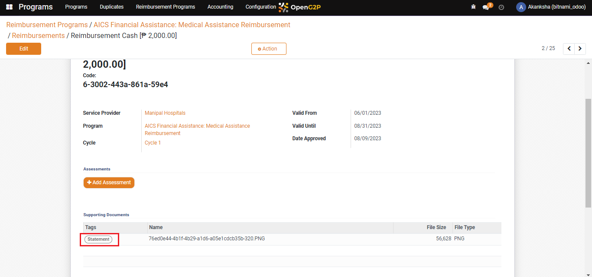
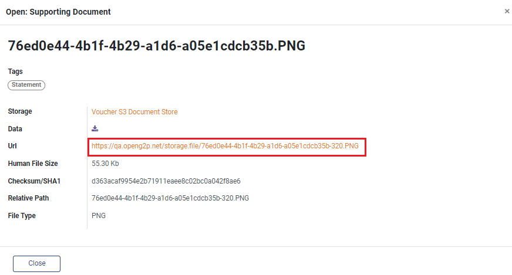
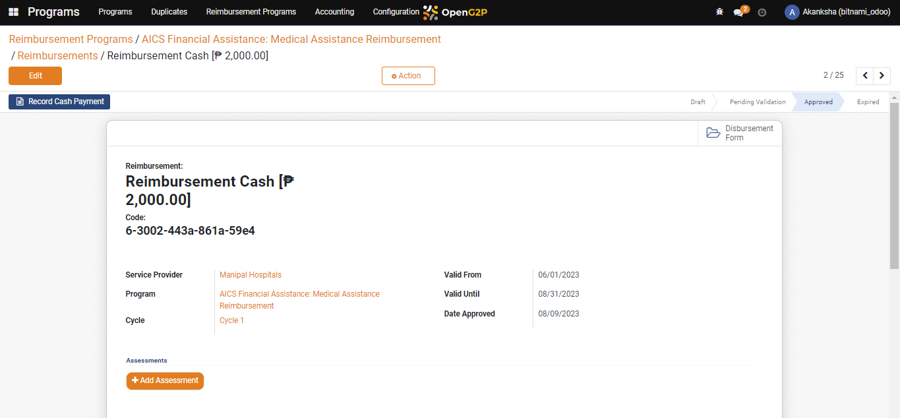
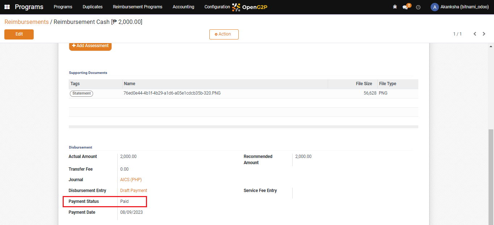
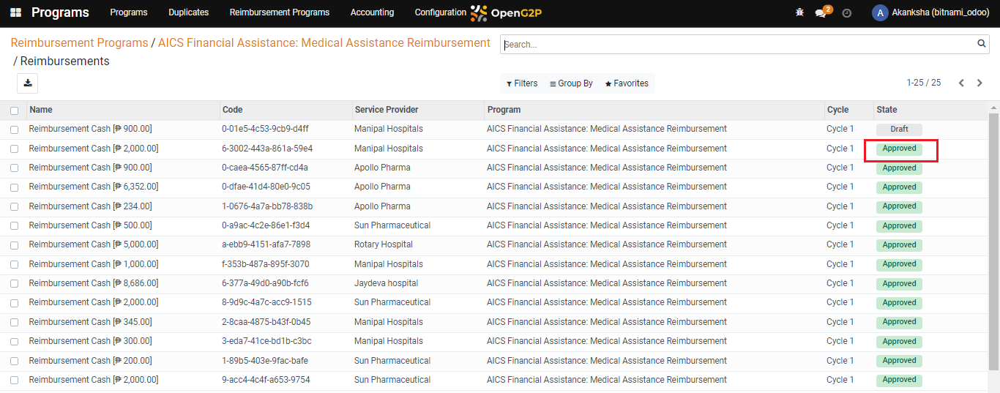

# Reimburse the service provider

## Description

This guide provides the steps for users to make payments i.e. to reimburse the service providers who have provided services to beneficiaries.

## Pre-requisites

The user must have the Program Administrator role.

## Steps

1. Navigate to _Programs_ using the menu bar.

<figure><figcaption></figcaption></figure>

2. Click on _Reimbursement Programs_.

<figure><figcaption></figcaption></figure>

3. Select the desired program for which reimbursement is required.

<figure><figcaption></figcaption></figure>

4. Navigate to the _Reimbursements_ section on the program detail view page.

<figure><figcaption></figcaption></figure>

5. Select the _Service Provider_ for which reimbursement is to be created.
6. The reimbursement will be in _Draft_ status.

<figure><figcaption></figcaption></figure>

7. On the reimbursement cash page, navigate to _Supporting Documents_ and click on _Statement_ to review the document_._

<figure><figcaption></figcaption></figure>

8. A pop-up window appears, click on _Url_ to review the provided document.

<figure><figcaption></figcaption></figure>

9. Navigate back to the reimbursement page and click on _Approve Reimbursement_.&#x20;

<figure><figcaption></figcaption></figure>

10. Once the entitlement is approved new button Record Cash Payment appears.
11. Click on _Record Cash Payment_.

<figure><figcaption></figcaption></figure>

12. Once the reimbursement cash is approved the Payment Status is shown as Paid.
13. And the reimbursement cash status for the service provider is changed to _Approved._

<figure><figcaption></figcaption></figure>

 

<figure><figcaption></figcaption></figure>

